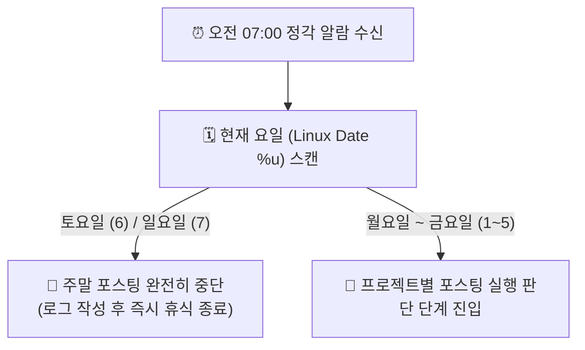
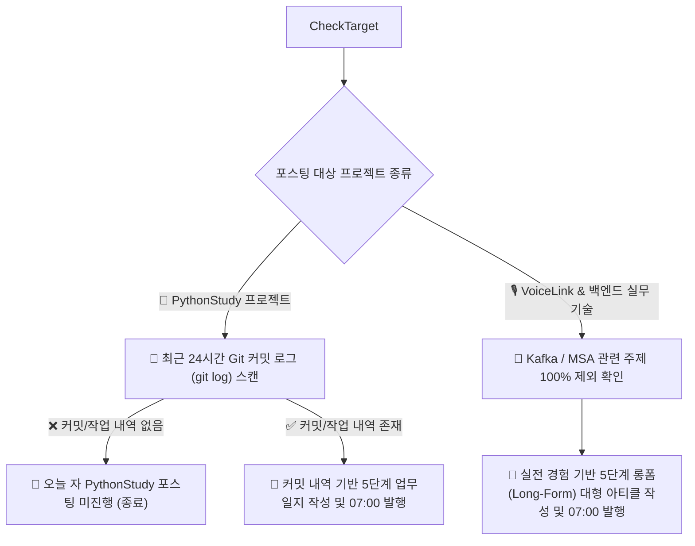
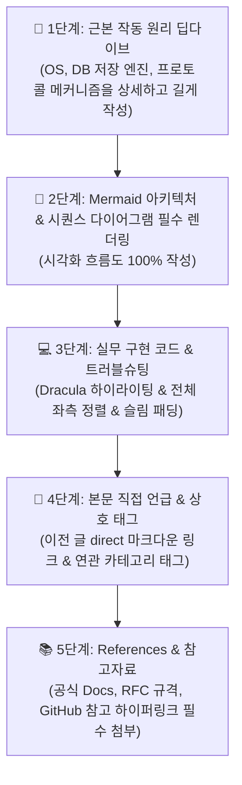

# ⏰ [마스터 매뉴얼] 매일 07:00 정기 포스팅 및 운영 프로세스 지침서

> **문서 상태**: 100% 최종 확정 및 지속 업데이트 문서 (Persistent Operating Protocol)  
> **최신 최신화 날짜**: 2026-08-02  
> **적용 대상 시스템**: WordPress (`wp-local`), Antigravity Agent Workflow, `career-ops` Pipeline  

---

## 1. ⏰ 루틴 실행 시각 및 인프라 환경 세팅

* **정확한 실행 시각**: 매일 오전 07:00:00 KST (한국 표준시 정각)
* **실행 대상 웹 서버**: 로컬 워드프레스 Docker 컨테이너 (`wp-local` / `http://localhost:8080`)
* **웹 루트 및 설정 파일 경로**: `/var/www/html/wp-content/mu-plugins/`
* **적용 UI/UX 테마 설정**: 
  - GeneratePress 테마 (`1100px` 컨테이너 폭, 좌측 사이드바 카테고리 메뉴)
  - Pretendard & Noto Sans KR 웹 폰트 (`word-break: keep-all`)
  - 모든 요소 **좌측 정렬** (`left-align-content.php`)
  - Dracula 테마 Syntax Highlighting (`auto-highlight.php`)
  - 슬림 코드 패딩 (`1em 1.2em`) & 카테고리 배지 패딩 (`3px 10px`)
  - 하단 중복 메타 제거 + **「← 이전 글」 / 「다음 글 →」 카드 네비게이션** (`post-navigation-bar.php`)

---

## 2. 🗓️ 요일 판단 및 주말 포스팅 완전 제외 수칙

오전 7시 정각이 되면 시스템은 가장 먼저 **현재 요일 (Linux System Date %u)**을 스캔합니다.

1. ❌ **토요일 (Saturday) & 일요일 (Sunday)**:
   * 오전 7시 알람이 발생하더라도 글을 작성하거나 올리는 일체 포스팅 행위를 완전히 거부합니다.
   * `[로그]: 주말(토/일)은 포스팅 휴무일입니다.` 만을 기록하고 프로세스를 즉시 종료하여 완전한 휴식을 보장합니다.
2. ✅ **월요일 ~ 금요일 (평일)**:
   * 평일 확인 즉시 3번 항목의 프로젝트별 실행 판단 단계로 진입합니다.

---

## 3. 🔀 프로젝트별 오전 7시 실행 조건 판단 (Strict Trigger Rules)

평일 오전 7시 포스팅은 **프로젝트의 성격과 Git 커밋 유무**에 따라 2가지 트랙으로 엄격히 나뉘어 동작합니다.

### 3-1. 🐍 트랙 A: `PythonStudy` 프로젝트 (Git 커밋 기반)
* **0순위 스캔 작업**: 해당 레포지토리의 최근 커밋 내역(`git log --since="24 hours ago"`) 및 diff 변화를 스캔합니다.
* ❌ **최근 24시간 동안 새로운 Git 커밋이나 작업 변경점이 없는 경우**:
  * 억지로 지어내서 글을 쓰지 않으며, 7시 포스팅을 일체 수행하지 않고 종료합니다.
* ✅ **새로운 Git 커밋이나 커밋 로그(예: `docs: ER Dose 파이프라인 복합 키 보정`)가 감지된 경우**:
  * 해당 실제 커밋 코드와 변경 내역을 바탕으로 4번 항목의 5단계 규격에 맞춰 업무일지 포스트를 생성하여 07:00에 게시합니다.

### 3-2. 🎙️ 트랙 B: `VoiceLink` & 백엔드 실무 기술 프로젝트 (기술 딥다이브)
* 🚫 **100% 제외 스택 (Scope Exclusion)**:
  * **Kafka (카프카)** 및 **MSA (마이크로서비스 아키텍처)** 관련 주제는 실제 진행하지 않은 기술이므로 **포스팅 주제에서 100% 완전히 삭제하고 일체 작성하지 않습니다.**
* ✅ **100% 실제 검증 기술 스택 (Allowed Scope)**:
  1. **VoiceLink 실시간 음성 기술**: WebRTC ICE Candidate, STUN/TURN (Coturn) 릴레이 서버, LiveKit 메디아 서버, WebSocket 시그널링, 5초 단위 Redis Timeline 통화 품질 측정
  2. **대용량 로그 ETL & DB 최적화**: PostgreSQL MVCC/WAL 원리, ER Dose 복합 키(`eq_name`, `lot_seq`) 데이터 보정, `ANALYZE` 통계 최적화, Apache Airflow 백필 멱등성
  3. **Spring Boot & 동시성 아키텍처**: Spring Boot, JPA/QueryDSL, Redis (Pub/Sub, Redisson 분산 락, TTL), JWT Access + Opaque Refresh Token
* **실행 방식**: Git 커밋 유무와 상관없이 평일 오전 7시에 깊이 있는 기술 아티클을 정기 포스팅합니다.

---

## 4. 📐 오전 7시 발행 포스트의 5단계 필체 & 구조 규격 (Unabridged 5-Step Guidelines)

오전 7시에 포스팅되는 모든 기술 글은 **축약이나 생략 없이 아주 상세하고 긴 분량 (Deep-Dive Long-Form Technical Article)**으로 5단계 구조를 거쳐 작성됩니다.

### 🧠 [1단계] 근본 작동 원리 딥다이브 (Deep-Dive Core Principles) - *가장 핵심적인 단계*
* 단순히 "오류를 고쳤다"에 그치지 않고, 엔지니어링의 본질인 **근본적인 작동 원리(Internal Mechanism)**를 길고 상세한 분량으로 파헤칩니다.
* **CS & 기술 이론 해부**:
  * **OS & 메모리 레벨**: Single-Thread Event Loop, Non-blocking I/O (`epoll`/`kqueue`), OS context switching, Thread Pool 동시성 모델
  * **네트워크 & 프로토콜 레벨**: WebRTC P2P ICE Candidate 바인딩, STUN UDP 홀칭, TURN TLS/UDP 패킷 릴레이 캡슐화, WebSocket 101 Switching Protocols
  * **DB & 저장소 엔진 레벨**: PostgreSQL MVCC (Tuple Versioning), WAL (Write-Ahead Logging), B-Tree 인덱스 블록 튜닝, `ANALYZE` 쿼리 플래너 통계정보 수집 원리
  * **분산 시스템 레벨**: Redisson Pub/Sub 기반 분산 락의 Redlock 알고리즘 작동 메커니즘과 Spin Lock과의 CPU 부하 차이 분석

### 📐 [2단계] Mermaid 아키텍처 & 시퀀스 다이어그램 필수 렌더링 (Mermaid Diagrams)
* 1단계에서 다룬 근본 원리가 전체 시스템에서 어떻게 데이터로 흐르는지 **Mermaid 다이어그램을 단 한 글도 빠짐없이 100% 필수 포함**하여 시각화합니다.
* `sequenceDiagram` (패킷 및 시그널링 흐름도) 또는 `flowchart TD` (데이터 파이프라인 아키텍처 구조도) 구문을 적용하여 직관적 시각화를 제공합니다.

### 💻 [3단계] 실무 구현 코드 & 트러블슈팅 (Implementation & Code)
* 이론을 코드로 이끌어낸 실무 소스 코드를 제시합니다.
* **Dracula 테마 Syntax Highlighting** 적용
* 슬림 코드 패딩 (`1em 1.2em`) 및 카테고리 배지 패딩 (`3px 10px`) 적용
* 모든 본문, 제목, 코드 블록을 CSS **좌측 정렬 (`left-align-content.php`)**로 출력하여 깔끔한 레이아웃 유지

### 🔗 [4단계] 본문 직접 언급 & 상호 태그 (Cross-Tagging & Direct Internal Linking)
* 본문 내용 중에서 이전에 게재되었던 관련 포스트를 **직접 텍스트로 언급하고 클릭 가능한 마크다운 링크(`http://localhost:8080/?p=ID`)**를 삽입합니다.
  * *(예시: "...이전에 다루었던 **[Voice-Link의 TURN/STUN 및 LiveKit 기반 최적화 전략](http://localhost:8080/?p=926)** 포스트에서 언급했듯이...")*
* 포스트 최하단에 `📌 함께 읽으면 좋은 연관 아티클` 섹션을 구성하여 직접 링크 카드를 연결합니다.
* 주제별 공통 태그 (`#WebRTC`, `#LiveKit`, `#PostgreSQL`, `#Redis`, `#Airflow` 등)를 십자 연결합니다.

### 📚 [5단계] References & 참고자료 (References Section)
* 포스트의 제일 마지막 하단에 아티클 작성의 바탕이 된 신뢰할 수 있는 레퍼런스 하이퍼링크를 필수로 첨부합니다.
  * **공식 문서**: PostgreSQL Official Docs, WebRTC Org, Redis Official Guide
  * **표준 규격**: IETF RFC 규격 문서 (RFC 5389 STUN 등)
  * **오픈소스**: GitHub 저장소 및 개발자 블로그 링크

---

## 5. 💼 [오전 7시 연동] 백엔드 채용 파이프라인 관리 (`career-ops`)

* 박준호 님의 **3년 차 Java / Spring Boot / 동시성·파이프라인 백엔드 이력서 (`cv.md`)**와 연동하여 채용 관리 파이프라인을 운영합니다.
* 사람인, 원티드, 잡코리아, 기업 자사 채용 페이지(오늘의집페이, 당근, 토스 등)의 우수 공고 추천 및 지원 현황 리포트([applications.md](file:///home/junho/IdeaProjects/career-ops/data/applications.md))를 지속적으로 유지·관리합니다.
