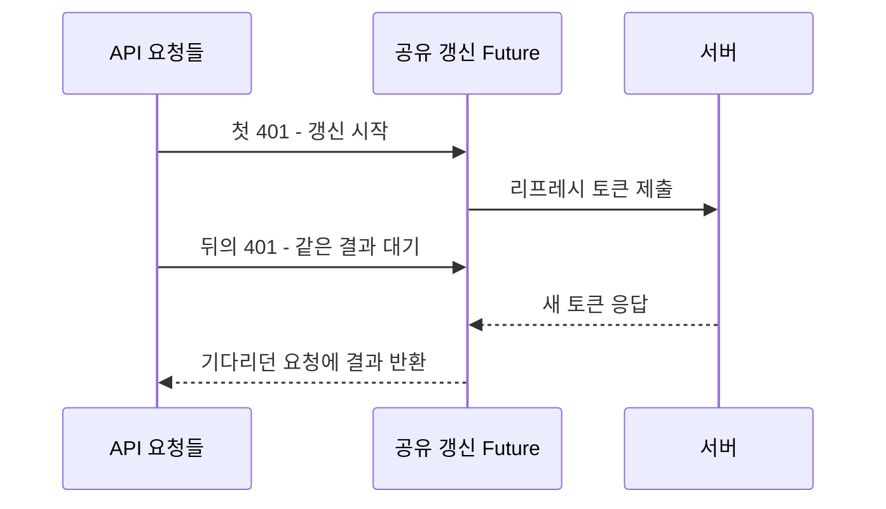

화면 하나를 열었는데 API 세 개가 동시에 401을 받았다고 하자. 각각 토큰을 갱신하면 되겠지 싶지만, 셋이 가진 리프레시 토큰은 같다.

VoiceLink 서버는 이 토큰을 한 번 쓰면 소비한다. 첫 갱신은 성공해도 나머지는 이미 사용한 토큰을 내밀게 된다. **갱신을 열심히 할수록 실패가 늘어날 수 있는 상황이다.** Java 17·Spring Boot 3.2.5·JJWT 0.12.5와 Flutter 구현을 이 순서로 읽었다.

## 세 요청이 나눠 가질 것은 새 토큰

원래 API까지 한 줄로 세울 필요는 없다. 함께 필요한 토큰 갱신 결과만 기다리면 된다.



첫 요청 A가 갱신을 시작하면 B와 C는 같은 `Future`를 기다린다. 새 토큰을 받으면 각자 원래 요청을 다시 보낸다. `dio_provider.dart`에서 이 역할을 하는 부분이다.

```dart
if (pendingRefresh != null) {
  return pendingRefresh;
}
final future = _performRefresh(tokenStorage);
setPendingRefresh(future);
try {
  return await future;
} finally {
  setPendingRefresh(null);
}
```

끝난 작업은 `finally`에서 비운다. 그래야 나중에 토큰이 다시 만료됐을 때 새 갱신을 시작할 수 있다. 갱신 후 다시 보내는 요청에는 재시도 표시를 붙인다. 여기서도 401이 오면 갱신을 반복하지 않는다.

이 공유 변수는 해당 클라이언트 인스턴스 안에 있다. 다른 탭이나 기기의 요청까지 한 번으로 합쳐 주지는 않는다.

## 서버가 읽으면서 지우는 이유

클라이언트가 요청을 합쳐도 서버가 같은 토큰의 재사용을 허용해서는 안 된다. `RefreshTokenService.rotate`는 정규화한 토큰의 해시로 키를 만든 뒤 사용자 참조를 가져오면서 지운다.

```java
String userId = redisTemplate.opsForValue()
        .getAndDelete(key(normalize(refreshToken)));
if (!StringUtils.hasText(userId)) {
    throw new InvalidRefreshTokenException(
        "리프레시 토큰이 만료되었거나 유효하지 않습니다.");
}
```

조회와 삭제를 나누면 두 요청이 삭제 전에 같은 값을 읽을 틈이 생긴다. `getAndDelete`는 그 틈을 없앤다. 이미 소비한 토큰으로 온 요청은 사용자 참조를 얻지 못하고 거절된다.

여기까지는 이전 토큰을 한 번만 쓰는 문제다. 새 토큰을 사용자에게 무사히 건네는 문제는 남아 있다.

## 갱신은 됐는데 새 토큰을 못 받았다면

서버가 새 토큰을 만든 직후 응답이 끊겼다고 해보자. 앱에는 옛 토큰만 남고 서버에서는 이미 소비됐다. **같은 요청을 다시 보낸다고 처음 상태로 돌아가지는 않는다.**

재로그인을 요구할지, 제한된 재사용 유예를 둘지 복구 정책이 필요하다. 유예는 사용성을 도울 수 있지만, 그만큼 이전 토큰을 다시 허용하는 조건도 설계해야 한다. 현재의 공유 `Future`가 이 선택까지 해결해 주는 것은 아니다.

응답을 받은 뒤에도 저장은 남는다. 앱은 액세스 토큰·리프레시 토큰·사용자 정보를 여러 번에 나눠 쓴다. 첫 쓰기만 성공하면 당장은 API가 되는데 다음 갱신에서 막힐 수 있다.

그래서 이 흐름의 다음 시험은 “401 세 개가 갱신 하나를 기다리는가”에서 끝나지 않는다. **응답이 끊기거나 저장이 중간에 멈췄을 때 앱에 어떤 인증 정보가 남는가**까지 봐야 한다.

## 참고 자료

- [OAuth 2.0 Security Best Current Practice](https://www.rfc-editor.org/rfc/rfc9700.html)
- [Redis GETDEL](https://redis.io/docs/latest/commands/getdel/)
- [JSON Web Token 표준](https://www.rfc-editor.org/rfc/rfc7519.html)

검토 범위: VoiceLink `1704b46`의 토큰 갱신 서비스·테스트·만료 설정, 인증 흐름 문서, Flutter 인터셉터와 토큰 저장소. 응답 유실·부분 저장은 구현에서 도출한 실패 시나리오이며 실제 장애 기록이 아니다.
