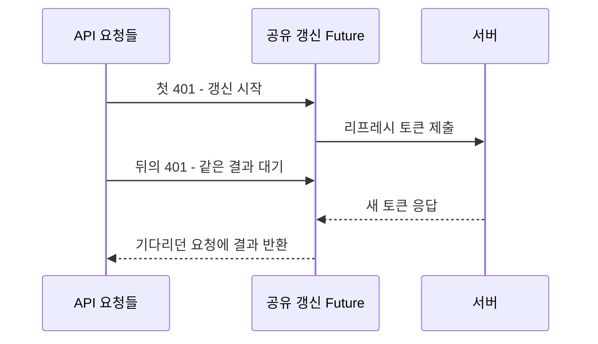

화면 하나를 열었는데 API 세 개가 동시에 401을 받았다고 하자. 각각 토큰을 갱신하면 되겠지 싶지만, 셋이 가진 리프레시 토큰은 같다.

VoiceLink 서버는 이 토큰을 한 번 쓰면 소비한다. 첫 갱신은 성공해도 나머지는 이미 사용한 토큰을 내밀게 된다. **갱신을 열심히 할수록 실패가 늘어날 수 있는 상황이다.** Java 17·Spring Boot 3.2.5·JJWT 0.12.5와 Flutter 구현을 이 순서로 읽었다.

## 세 요청이 나눠 가질 것은 새 토큰

원래 API까지 한 줄로 세울 필요는 없다. 함께 필요한 토큰 갱신 결과만 기다리면 된다.



첫 요청 A의 갱신이 진행되는 동안 B와 C의 401 처리가 겹치면 같은 `Future`를 기다린다. 새 토큰을 받으면 각자 원래 요청을 다시 보낸다. `dio_provider.dart`에서 이 역할을 하는 부분이다.

```dart
if (pendingRefresh != null) {
  return pendingRefresh;
}
final future = _performRefresh(tokenStorage);
setPendingRefresh(future);
try {
  return await future;
} finally {
  setPendingRefresh(null);
}
```

끝난 작업은 `finally`에서 비운다. A가 갱신하는 동안 도착한 B는 함께 기다리지만, A가 끝난 뒤 처리된 C의 401은 새 갱신을 시작할 수 있다. **묶는 기준은 같은 화면이 아니라 갱신이 진행 중인지다.**

갱신 후 원래 요청에는 `retriedAfterRefresh=true`를 붙인다. 이 요청이 또 401을 받으면 갱신을 반복하지 않는다. `/auth/refresh` 자체도 갱신 대상에서 제외한다. 원래 API의 재시도와 토큰 API의 재시도가 꼬여 무한히 돌지 않도록 구분한 것이다.

이 공유 변수는 해당 클라이언트 인스턴스 안에 있다. 다른 탭이나 기기의 요청까지 한 번으로 합쳐 주지는 않는다.

## 서버가 읽으면서 지우는 이유

클라이언트가 요청을 합쳐도 서버가 같은 토큰의 재사용을 허용해서는 안 된다. `RefreshTokenService.rotate`는 정규화한 토큰의 해시로 키를 만든 뒤 사용자 참조를 가져오면서 지운다.

```java
String userId = redisTemplate.opsForValue()
        .getAndDelete(key(normalize(refreshToken)));
if (!StringUtils.hasText(userId)) {
    throw new InvalidRefreshTokenException(
        "리프레시 토큰이 만료되었거나 유효하지 않습니다.");
}
```

조회와 삭제를 나누면 두 요청이 삭제 전에 같은 값을 읽을 틈이 생긴다. Redis의 `GETDEL`에 해당하는 `getAndDelete`는 한 명만 사용자 참조를 가져가게 한다. 난수 토큰 원문 대신 SHA-256 해시를 키에 쓰고, 기본 만료는 30일이다.

`rotateDeletesOldTokenAndIssuesNewToken` 테스트는 `getAndDelete` 호출과 새 토큰 저장을 검사한다. `rotateRejectsMissingToken`은 조회 결과가 없으면 거절되는 분기를 다룬다. Redis를 모의 객체로 바꾼 단위 테스트라 두 요청의 실제 경쟁까지 실행한 근거는 아니다.

그다음 순서는 사용자 조회 → 새 리프레시 토큰 저장이다. 이전 토큰을 지운 뒤 사용자 조회나 새 저장이 실패해도 삭제가 되돌아오지는 않는다. Redis 명령 하나가 원자적이라는 말이 갱신 전체의 성공까지 뜻하지는 않는다.

## 갱신은 됐는데 새 토큰을 못 받았다면

서버가 새 토큰을 만든 직후 응답이 끊겼다고 해보자. 앱에는 옛 토큰만 남고 서버에서는 이미 소비됐다. **같은 요청을 다시 보낸다고 처음 상태로 돌아가지는 않는다.**

앱의 `_performRefresh`는 요청·저장 중 예외를 잡으면 `null`을 돌려준다. 원래 401 처리에서는 세션 만료 신호를 올린다. 이전 토큰의 유예 재사용이나 갱신 결과 재조회는 여기서 제공하지 않는다. 서버가 새 토큰을 발급했다고 앱의 인증이 이어지는 것은 아니다.

응답을 받으면 앱은 액세스 토큰부터 쓰고, 리프레시 토큰과 사용자 정보를 차례로 저장한다. 두 번째 쓰기에서 실패하면 새 액세스 토큰과 옛 리프레시 토큰이 섞일 수 있다. `_performRefresh`는 이 저장 예외도 잡아 실패를 반환한다.

다음 시험은 그 두 번째 쓰기에 실패를 주입하는 것이다. 남은 인증 정보가 정리되고 다시 로그인할 수 있는지까지 봐야 “갱신 실패”가 사용자에게 어떤 상태로 끝나는지 알 수 있다.

## 참고 자료

- [OAuth 2.0 Security Best Current Practice](https://www.rfc-editor.org/rfc/rfc9700.html)
- [Redis GETDEL](https://redis.io/docs/latest/commands/getdel/)
- [JSON Web Token 표준](https://www.rfc-editor.org/rfc/rfc7519.html)

검토 범위: VoiceLink `b159c1d`의 `RefreshTokenService`·만료 설정, `docs/handover-server.md`, Flutter의 `dio_provider.dart`·`token_storage.dart`와 기능 추가 이력 `2ba1bf7`. 같은 관련 소스를 가진 로컬 `1704b46`에서 2026-10-10 리프레시 서비스 4개·JWT 제공자 3개 테스트의 통과를 재확인했다. Redis는 모의 객체를 사용했으며 응답 유실·부분 저장과 Flutter의 동시 401은 실행하지 않은 시험 시나리오다.
