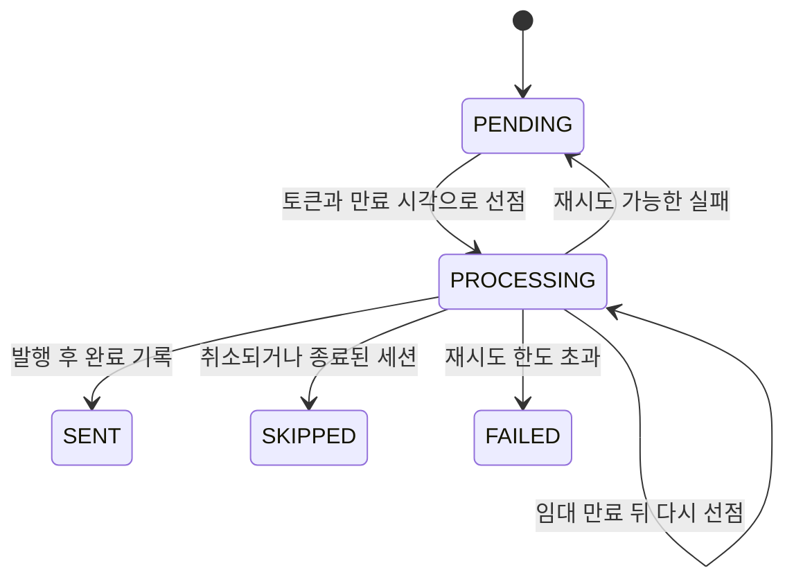

통화방은 저장됐는데 결과를 보내기 전에 서버가 꺼지면, 사용자는 계속 기다릴 수 있다. VoiceLink의 Outbox는 통화방과 “보낼 결과”를 같은 DB 트랜잭션에 남겨 이 틈을 다룬다.

변경 이력 `5091eba` 전에는 `publishPending`의 트랜잭션 안에서 행을 잠그고 외부 발행까지 했다. 이후에는 선점 트랜잭션과 발행을 나누고 임대 토큰을 붙였다. Java 17·Spring Boot 3.2.5 코드에서 무엇이 달라졌는지 행 하나로 따라가 보자. 아래 워커 A·B의 순서는 설명용이다.

## 1번 행을 기다리는 대신 2번 행 처리하기

A가 1번 행을 잡았는데 B도 같은 행을 기다린다면 워커를 늘린 의미가 줄어든다. 저장소는 지금 처리할 수 있는 미완료 행을 고르되, 잠긴 행은 건너뛴다.

```sql
SELECT *
FROM match_outbox
WHERE sent_at IS NULL
  AND status IN ('PENDING', 'PROCESSING')
  AND (next_attempt_at IS NULL OR next_attempt_at <= :now)
  AND (locked_until IS NULL OR locked_until <= :now)
ORDER BY COALESCE(next_attempt_at, created_at), id
LIMIT :limit
FOR UPDATE SKIP LOCKED
```

A가 1번을 잠근 동안 B는 다른 행으로 간다. 저장소 테스트는 A가 잠갔다는 신호를 받은 뒤 B를 시작한다. “우연히 다른 행을 골랐다”가 아니라 잠금이 유지된 상태에서 건너뛰는지 보는 것이다.

2026-10-10 PostgreSQL 16 컨테이너에서 이 테스트 1개가 통과했다. 기본 실행은 Docker API 버전 불일치로 건너뛰었고, 테스트 JVM의 API 버전을 `1.40`으로 지정한 재실행에서 확인한 결과다.

대신 **오래된 행부터 엄격하게 완료되는 순서는 포기한다.** `ORDER BY`가 있어도 잠긴 행을 건너뛰기 때문이다.

고른 행에는 임대 토큰과 만료 시각을 적고 트랜잭션을 끝낸다. 외부 발행은 그 뒤에 실행한다. 네트워크 응답을 기다리는 동안 DB 잠금을 계속 잡지 않으려면, 잠금이 풀린 뒤에도 담당자를 구별할 방법이 필요하다.

## 잠금 다음에는 임대 토큰



예를 들어 A의 작업이 오래 걸려 임대가 만료되면 B가 새 토큰으로 가져갈 수 있다. 이때 뒤늦게 돌아온 A가 “완료”를 적으면 B의 작업을 덮어쓴다.

완료·실패를 적을 때 `findByIdAndLeaseToken`으로 행 ID와 토큰을 함께 찾고 쓰기 잠금을 건다. B의 토큰으로 바뀌었다면 A의 갱신을 반영하지 않는다. `PROCESSING`은 “아직 안 보냈다”보다 “현재 누군가 맡고 있다”에 가깝다.

임대 시각이 지났다고 A의 실행이 중단되는 것은 아니다. **토큰은 늦은 DB 갱신을 막지만, 이미 보낸 메시지를 회수하지는 않는다.**

## 완료 도장을 못 찍은 메시지는 다시 나갈 수 있다

브로커가 메시지를 받은 직후, `SENT`를 적기 전에 프로세스가 끝났다고 하자. DB에는 미완료 행이 남아 다음 워커가 다시 보낸다. [소비 측은 같은 결과를 다시 받는다](https://so-dak.com/spring-boot-sseserver-sent-events%eb%a1%9c-%ec%8b%a4%ec%8b%9c%ea%b0%84-%eb%a7%a4%ec%b9%ad-%ec%83%81%ed%83%9c-%ed%91%b8%ec%8b%9c-%ea%b5%ac%ed%98%84%ed%95%98%ea%b8%b0/).

이 상태에서 중복을 무조건 피하려고 재발행을 막으면, 실제로 보내지 못한 결과도 포기할 수 있다. **다시 보낼 수 있게 하되, 받는 쪽에서 같은 결과를 중복 반영하지 않게 하는 설계**가 함께 필요하다.

유효한 결과는 캐시에 저장한 뒤 발행하고 `SENT`를 적는다. 실패하면 임대를 비우고 다음 시각을 예약한다. 기본 임대는 120초다. 실패를 기록할 때 `attempts`를 올리고, 5회에 도달하면 `FAILED`로 끝낸다. 실패가 매번 기록되는 경우에는 1·2·4·8초를 기다린 뒤 다섯 번째 실패에서 멈춘다. 실제 대기에는 1초 주기의 조회와 워커 대기 시간도 더해지며, 지수 대기의 설정 상한은 60초다.

**실패 기록 횟수와 실제 발행 횟수는 다르다.** 완료·실패를 적기 전에 프로세스가 종료되면 횟수는 그대로이고, 임대 만료 뒤 다시 선점할 수 있다. 따라서 이 설정만으로 외부 발행을 최대 다섯 번으로 제한하지는 않는다.

`markFailedKeepsTerminalFailureVisible` 테스트는 실패 기록이 이미 네 번인 행을 다시 실패 처리해 `FAILED`, 오류 보존, 빈 `sent_at`을 검사한다. 보내지 못한 행에 완료 도장을 찍던 이전 `abandon` 방식과 달라진 부분이다.

또 하나 구분할 점이 있다. 매칭 확정 코드에는 트랜잭션 메서드 안에서 로컬 대기 응답을 완료하는 경로도 있다. Outbox를 넣었다고 모든 응답이 커밋 이후로 옮겨지는 것은 아니다.

다음에 끊어 볼 지점은 발행 직후다. 그때 워커를 멈추고 다시 실행했을 때, **행은 회수되면서 같은 세션의 화면 전환은 한 번만 일어나는지**를 봐야 저장부터 수신까지 이어진다.

## 참고 자료

- [PostgreSQL SELECT 잠금 절](https://www.postgresql.org/docs/16/sql-select.html)
- [PostgreSQL 명시적 잠금](https://www.postgresql.org/docs/16/explicit-locking.html)
- [Spring 트랜잭션 경계](https://docs.spring.io/spring-framework/reference/data-access/transaction/declarative/annotations.html)

검토 범위: VoiceLink `b159c1d`의 `MatchFinalizer`, Outbox 저장소·임대·발행 코드와 설정, `docs/matching-stability.md`와 변경 이력 `5091eba`. 2026-10-10 동일한 관련 소스의 로컬 `1704b46`에서 Outbox 서비스 2개·임대 서비스 3개·발행기 3개 테스트가 통과했다. PostgreSQL 동시 선점 테스트는 위 API 버전 보정 조건으로 별도 통과했다. 발행 직후 강제 종료와 화면 중복 반영은 추가 검증 대상이다.
