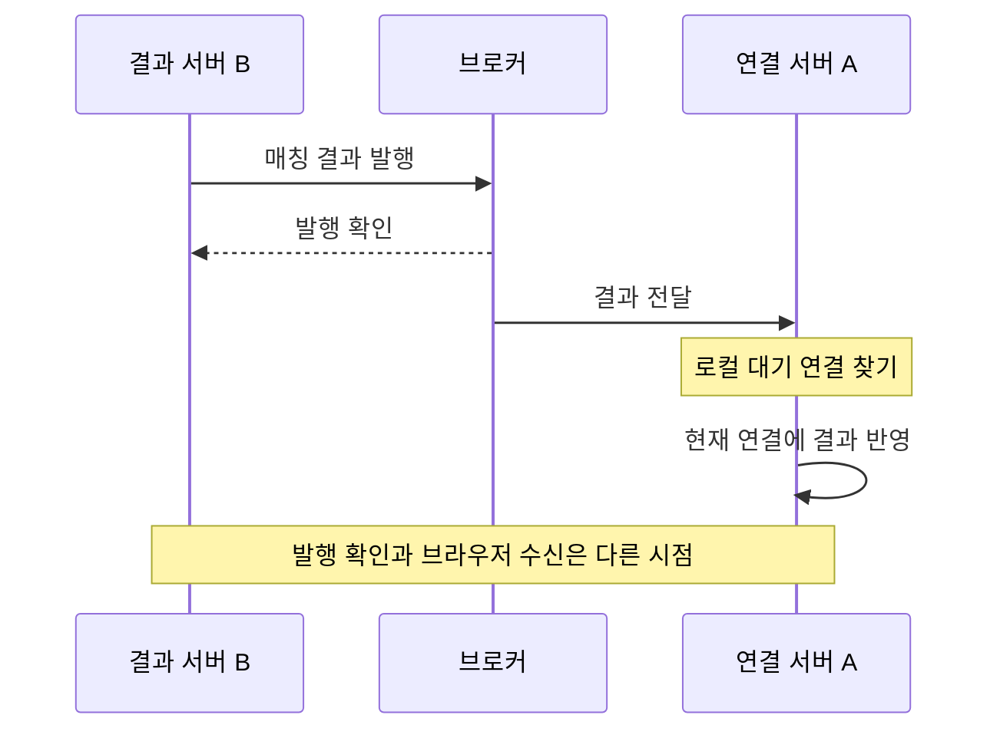

사용자는 서버 A에 연결돼 있는데 매칭은 서버 B에서 끝났다고 하자. B가 “상대 찾았어요”를 만들어도 A의 연결 객체에 바로 쓸 수는 없다. 그 객체는 A의 메모리에 있다.

VoiceLink의 매칭 결과 경로는 연결을 옮기는 대신 **결과를 연결이 있는 서버로 보낸다.** 서버를 두 대로 나눈 설명용 상황으로 보면 브로커가 필요한 이유가 드러난다.



RabbitMQ의 fanout exchange와 인스턴스별 큐가 각 서버에 결과를 전한다. 받은 서버는 자기 로컬 대기에서 사용자를 찾아 완료한다. 발행 실패 시 Redis Pub/Sub를 시도하는 경로도 있다.

여기서 브로커의 확인을 화면 수신으로 읽으면 한 단계를 건너뛴다. 브로커가 받은 직후 연결이 끊길 수도 있다. 확인 응답만 유실돼 다른 경로로 다시 보냈다면 같은 결과가 두 번 올 수도 있다.

## 새 연결을 지우는 오래된 뒷정리

서버 사이의 전달을 붙였어도 연결 교체는 별도로 다뤄야 한다. 한 서버에서도 다음 순서가 가능하다.

1. 사용자가 처음 연결한다.
2. 나갔다가 돌아와 새 연결을 등록한다.
3. 첫 연결의 종료 콜백이 뒤늦게 실행된다.

사용자 ID로만 지우면 옛 연결이 새 연결까지 치워 버린다. 뒷정리가 너무 성실한 셈이다. `LocalWaitingRegistry`는 먼저 종료 중인 요청이 현재 요청과 같은지 비교한다.

```java
MatchingQueue.WaitingClient client = localWaiters.get(userId);
if (client == null || client.deferredResult() != deferredResult) {
    return false;
}
boolean removed = localWaiters.remove(userId, client);
if (removed) {
    completeDeferredAsWaiting(client);
}
return removed;
```

첫 비교를 통과한 뒤에도 새 연결이 등록될 수 있다. 그래서 마지막 삭제도 `remove(userId, client)`로 **방금 읽은 객체가 그대로 있을 때만** 실행한다. 사용자 일치와 요청 일치를 함께 보는 이유다.

관련 테스트에는 옛 요청의 종료가 새 대기를 제거하지 않는 경우가 있다. 연결 객체를 전역 사용자 상태처럼 취급하면 놓치기 쉬운 조건이다.

## 연결이 없을 때 남겨 둘 것

실시간 전달만으로는 접속이 끊긴 동안을 메울 수 없다. Redis Pub/Sub도 놓친 메시지를 보관해 재생하는 방식은 아니다. [Outbox 워커](https://so-dak.com/%eb%b6%84%ec%82%b0-%ec%8b%9c%ec%8a%a4%ed%85%9c-%ec%a0%95%ed%95%a9%ec%84%b1-%eb%b3%b4%ec%9e%a5-transactional-outbox-pattern%ec%9c%bc%eb%a1%9c-%eb%a7%a4%ec%b9%ad-%ec%9d%b4%eb%b2%a4%ed%8a%b8-%eb%b0%9c/)가 발행 전에 결과 캐시에 저장하는 것은 다시 찾을 자리를 남기기 위해서다.

다만 캐시에는 만료 시간이 있고 읽기·삭제가 나뉜 부분도 있다. 서버가 대기를 완료하고 캐시를 지웠다는 사실은 브라우저가 화면을 바꿨다는 확인이 아니다. 통화 종료·연장 이벤트 역시 이 매칭 결과 전파와 별도의 경로이므로 같은 보장을 가정할 수 없다.

다음 검증은 A에 연결한 채 B에서 결과를 만들고, 전달 직전에 연결을 끊었다가 다시 붙이는 순서가 적절하다. 캐시 복구와 중복 수신을 같이 볼 수 있다.

반대로 서버의 전송까지 확인됐는데 화면만 늦다면 프록시 버퍼링을 살펴본다. **결과 생성, 브로커 도착, 연결 전송, 화면 반영을 나누면** “분명 보냈는데” 다음에 볼 곳이 정해진다.

## 참고 자료

- [SSE 표준](https://html.spec.whatwg.org/multipage/server-sent-events.html)
- [RabbitMQ 발행 확인과 소비 확인](https://www.rabbitmq.com/docs/confirms)
- [Redis Pub/Sub 전달 특성](https://redis.io/docs/latest/develop/pubsub/)
- [Nginx proxy buffering](https://nginx.org/en/docs/http/ngx_http_proxy_module.html#proxy_buffering)

검토 범위: VoiceLink `1704b46`의 매칭 전달·로컬 대기·결과 저장 코드, 브로커 설정과 매칭·프록시 문서, 연결 교체 테스트. 다중 서버 단절·재연결 시나리오는 운영 시험 결과가 아닌 추가 검증 항목이다.
