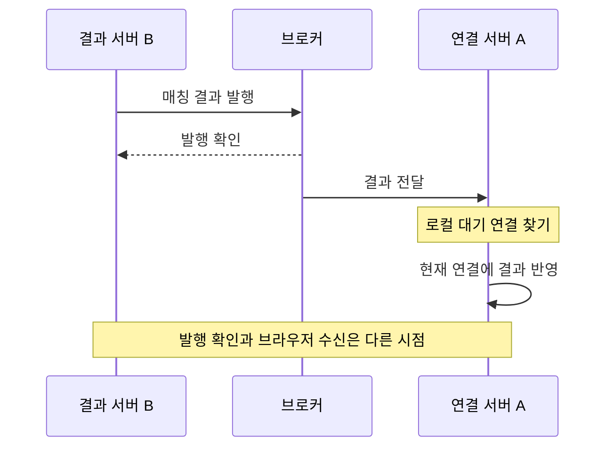

사용자는 서버 A에 연결돼 있는데 매칭은 서버 B에서 끝났다고 하자. B가 “상대 찾았어요”를 만들어도 A의 연결 객체에 바로 쓸 수는 없다. 그 객체는 A의 메모리에 있다.

VoiceLink는 **결과를 연결이 있는 서버로 보낸다.** 아래 두 서버는 전달 단계를 설명하기 위한 예시다. `b159c1d`와 로컬 `1704b46`에서 이 경로의 코드·설정이 동일함을 대조했다.



`RabbitMqConfig`는 fanout exchange에 인스턴스별 큐를 연결한다. 이름 설정이 없으면 임시 큐를 만들고, 이름을 지정해도 현재 설정은 비영속·자동 삭제 큐다. exchange가 영속이라는 이유만으로 연결 서버가 내려간 동안의 모든 알림이 보관된다고 읽을 수는 없다.

수신한 `RabbitMqMatchResultListener`는 `MatchingQueue.handleMatchResultPayload()`를 호출한다. 이 메서드가 로컬 사용자의 `DeferredResult`를 완료하면 `MatchStreamSession`이 `event: match`를 보낸다. 브로커 메시지가 HTTP 연결 자체가 되는 것이 아니라, 연결이 있는 서버에서 한 번 더 응답으로 바뀌는 것이다.

## ack인데도 발행 실패인 경우

`RabbitMqMatchResultPublisherTest`에는 `publishRejectsReturnedMessageEvenWhenAcknowledged`가 있다. 브로커가 ack를 줬어도 메시지가 반환됐다면 성공으로 처리하지 않는 테스트다. 실제 발행 코드는 confirm을 기다린 다음 두 조건을 따로 검사한다.

```java
if (confirm == null || !confirm.isAck()) {
    String reason = confirm == null ? "missing confirm" : confirm.getReason();
    throw new IllegalStateException(
            "RabbitMQ publish not acknowledged: " + reason);
}
if (correlationData.getReturned() != null) {
    throw new IllegalStateException(
            "RabbitMQ publish returned: "
                    + correlationData.getReturned().getReplyText());
}
```

검사 부분만 발췌했다. 기본 confirm 대기는 5,000ms다. 받을 큐가 없어 반환됐다면 브로커가 메시지를 받았어도 다음 서버로 갈 수 없다. 이 검사까지 통과한 뒤에도 A가 로컬 대기를 찾고 HTTP 연결에 보내는 단계는 남는다.

발행 예외가 생기면 `MatchResultRealtimePublisher`가 Redis Pub/Sub를 시도한다. RabbitMQ가 성공하면 Redis로 다시 보내지 않고, 두 경로가 모두 실패하면 예외를 위로 올린다. 각각 별도 테스트가 있다. 다만 confirm만 유실돼 Redis를 시도한 상황이라면 같은 결과가 두 경로로 도착할 여지는 남는다. 전송 경로를 하나 더 붙인 것과 정확히 한 번 도착하게 만든 것은 다르다.

## 새 연결을 지우는 오래된 뒷정리

서버 사이의 전달을 붙였어도 연결 교체는 별도로 다뤄야 한다. 한 서버에서도 다음 순서가 가능하다.

1. 사용자가 처음 연결한다.
2. 나갔다가 돌아와 새 연결을 등록한다.
3. 첫 연결의 종료 콜백이 뒤늦게 실행된다.

사용자 ID로만 지우면 옛 연결이 새 연결까지 치워 버린다. 뒷정리가 너무 성실한 셈이다. `LocalWaitingRegistry`는 먼저 종료 중인 요청이 현재 요청과 같은지 비교한다.

```java
MatchingQueue.WaitingClient client = localWaiters.get(userId);
if (client == null || client.deferredResult() != deferredResult) {
    return false;
}
boolean removed = localWaiters.remove(userId, client);
if (removed) {
    completeDeferredAsWaiting(client);
}
return removed;
```

첫 비교를 통과한 뒤에도 새 연결이 등록될 수 있다. 그래서 마지막 삭제도 `remove(userId, client)`로 **방금 읽은 객체가 그대로 있을 때만** 실행한다. 사용자 일치와 요청 일치를 함께 보는 이유다.

`removeAndCompleteAsWaitingIfCurrentDoesNotRemoveNewerWaiter` 테스트는 동일 사용자로 이전·새 요청을 차례로 등록한다. 이전 요청을 넘겨 삭제를 시도한 뒤 반환값이 `false`이고, 저장된 요청은 여전히 새 요청인지 확인한다.

`MatchingQueue.removeAndCompleteIfCurrent()`는 이 삭제가 성공했을 때만 Redis 대기도 정리한다. 이미 새 요청으로 바뀌어 로컬 삭제가 거절되면 Redis 정리도 건너뛴다. 단, 로컬 삭제와 Redis 제거 사이까지 하나의 원자적 작업으로 묶은 코드는 아니다.

SSE 안의 대기는 한 번으로 끝나지 않는다. `WAITING`이면 다음 대기를 예약하고, `MATCHED`이면 결과를 보내고 스트림을 끝낸다. 대기 제한 25초의 기본 설정에서 재대기 지연과 heartbeat 간격은 각각 5초다. 이는 예약 설정이지 사용자 화면에 정확히 5초마다 도착한다는 측정값은 아니다.

## 연결이 없을 때 남겨 둘 것

실시간 전달만으로는 접속이 끊긴 동안을 메울 수 없다. Redis Pub/Sub도 놓친 메시지를 보관해 재생하는 방식은 아니다. [Outbox 워커](https://so-dak.com/%eb%b6%84%ec%82%b0-%ec%8b%9c%ec%8a%a4%ed%85%9c-%ec%a0%95%ed%95%a9%ec%84%b1-%eb%b3%b4%ec%9e%a5-transactional-outbox-pattern%ec%9c%bc%eb%a1%9c-%eb%a7%a4%ec%b9%ad-%ec%9d%b4%eb%b2%a4%ed%8a%b8-%eb%b0%9c/)가 발행 전에 결과 캐시에 저장하는 것은 다시 찾을 자리를 남기기 위해서다.

결과 캐시의 기본 만료는 대기 제한 25초에 30초를 더한 55초다. `RedisMatchingStore.claimMatchResult()`는 값을 읽고 삭제한 뒤 JSON을 해석한다. 무기한 보관도 아니고 읽기·삭제가 하나의 원자적 호출도 아니다. 서버가 대기를 완료하고 캐시를 지웠다는 사실 역시 브라우저 화면 반영의 확인은 아니다.

Flutter 쪽은 Dio의 스트림 응답을 UTF-8과 줄 단위로 해석한 뒤 `MatchSseParser`에 넘긴다. 파서 테스트는 `event: match`를 매칭 결과로 바꾸고, `: ping` 같은 주석과 다른 이벤트는 무시하며, 마지막 빈 줄 없이 스트림이 끝난 payload도 처리하는지 확인한다. **HTTP 연결이 열려 있는 것과 앱이 매칭 결과를 해석한 것은 여기서도 나뉜다.** 2026-10-09 매칭·통화 이벤트 파서 테스트 다섯 개를 다시 실행해 통과했다.

2026-10-10 서버의 `LocalWaitingRegistryTest` 네 개, `MatchResultRealtimePublisherTest` 세 개, `MatchStreamingServiceTest` 다섯 개도 다시 통과했다. 대기 교체·대체 발행·재대기 등록을 검사한 결과이며, RabbitMQ·Redis를 실제로 끊은 다중 서버 시험은 아니다.

통화 종료·연장 이벤트는 `CallEventStreamingService`와 별도의 `event: call` 파서를 사용한다. 매칭 브로커 설정을 읽었다고 이 경로까지 같은 전달 보장을 얻었다고 해석하면 안 된다.

다음 검증은 A에 연결한 채 B에서 결과를 만들고, 전달 직전에 끊었다가 다시 붙이는 순서다. 캐시에서 복구하는지, 두 번 온 결과가 화면을 중복 전환시키는지 본다.

서버의 전송까지 확인했는데 화면만 늦다면 프록시 버퍼링도 살펴본다. “분명 보냈는데”에서 멈추지 않으려면 **어느 단계까지 도착했는지**를 남겨야 한다.

## 참고 자료

- [SSE 표준](https://html.spec.whatwg.org/multipage/server-sent-events.html)
- [RabbitMQ 발행 확인과 소비 확인](https://www.rabbitmq.com/docs/confirms)
- [Redis Pub/Sub 전달 특성](https://redis.io/docs/latest/develop/pubsub/)
- [Nginx proxy buffering](https://nginx.org/en/docs/http/ngx_http_proxy_module.html#proxy_buffering)

검토한 근거: VoiceLink `b159c1d`의 `RabbitMqConfig`, `RabbitMqMatchResultPublisher`와 테스트, `MatchResultRealtimePublisher`와 테스트, `MatchingQueue`, `LocalWaitingRegistry`와 테스트, `MatchStreamSession`, `RedisMatchingStore`, `frontend/lib/src/features/match/data/match_api.dart`, `docs/redis-matching-flow.md`. `5091eba` 변경 내역에서 RabbitMQ 전달과 Redis 대체 발행의 추가도 확인했다.
