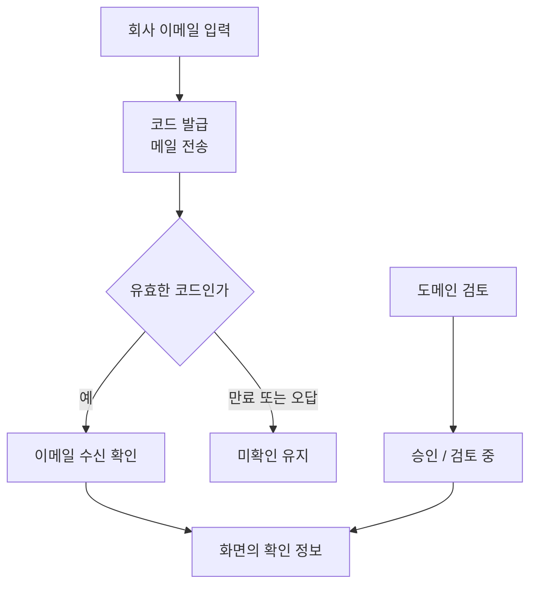

회사 이메일 확인에 체크 표시 하나를 붙이려면, 먼저 그 표시가 무엇을 보장하는지 정해야 한다.

설명용 주소 `member@example.org`로 보낸 코드를 맞혔다고 하자. 확인된 것은 메일을 받을 수 있다는 사실이다. 메일함 열쇠가 재직증명서는 아니다. 입력한 회사 이름까지 맞다고 볼 수도 없다.

VoiceLink 문서는 이 차이를 기능의 범위로 정한다. **사용자의 메일 수신 확인과 도메인의 회사명 승인은 별도 상태다.**

A가 코드를 맞혔어도 그 도메인의 회사명은 검토 중일 수 있다. 나중에 도메인을 승인했다고 같은 회사 주소를 입력한 B까지 확인 완료가 되지는 않는다. **도메인은 함께 쓰지만 메일 수신 확인은 사용자별이다.**

용어를 고친 변경 이력 `07ed42c`도 “직장인 모드”를 “회사 이메일 확인”으로 바꾼다. 코드가 확인한 사실에 이름을 맞춘 것이다. 재직 증빙이나 직장인 전용 매칭 큐 분리까지 구현한 기능은 아니다.

## 먼저 도착한 메일이 최신 코드는 아닐 수 있다

코드 발급에는 세 가지 제한이 있다. 모두 “기다리는 시간”처럼 보여도 막으려는 행동이 다르다.

| 제한 | 현재 기본값 | 판단하는 질문 |
| --- | --- | --- |
| 코드 유효 시간 | 300초 | 이 코드로 아직 확인할 수 있는가 |
| 재전송 대기 | 60초 | 새 메일을 다시 요청해도 되는가 |
| 확인 시도 횟수 | 5회 | 같은 발급 건에서 더 확인할 수 있는가 |

발송을 반복하는 요청과 짧은 코드를 계속 찍어 보는 요청을 같은 제한으로 다루기는 어렵다. 코드 수명, 재전송 간격, 오답 횟수를 각각 두는 이유다.

같은 주소의 첫 메일이 늦어 1분 뒤 새 코드를 요청했다고 해보자. 임시 상태는 `workplace:verification:pending:{userId}:{email}`에 저장하므로 새 코드가 이전 값을 덮어쓴다. 옛 메일이 뒤늦게 와도 맞는 코드는 새 발급 건의 값이다.

반면 재전송 대기는 주소가 아니라 사용자 ID를 기준으로 둔다. 주소만 바꿔도 60초 제한을 피하지는 못한다. 다른 주소로 발급했던 임시 상태까지 한꺼번에 지우는 구조는 아니다.

오답을 입력할 때도 수명은 다시 300초로 시작하면 안 된다. 서비스는 Redis에서 남은 TTL을 읽어 시도 횟수를 올린 상태를 그 시간만큼 저장한다. `confirmCodeRejectsOnMismatchAndIncreasesAttemptCount` 테스트는 남은 시간을 120초로 두고, `attempts=1`과 **120초 TTL이 함께 저장되는지** 검사한다. 화면의 카운트다운은 이 서버 판단을 안내할 뿐이다.

## 메일을 보냈다는 기록만으로 완료할 수 없는 이유

서비스는 Redis에 임시 상태를 저장한 다음 메일을 보낸다. 발송 중 `MailException`이 나면 해당 임시 상태와 재전송 대기를 지운다. 다만 외부 메일 시스템이 요청을 받은 뒤 응답만 끊겼다면, 사용자는 도착한 메일의 코드를 넣고도 유효한 발급 건을 찾지 못할 수 있다.

코드를 맞힌 뒤에는 다른 경쟁이 생긴다. 발급 시점에 비어 있던 주소를 다른 계정이 먼저 등록할 수 있다. `completeWorkplaceVerification`은 중복을 다시 조회하고 `saveAndFlush`로 저장한다. DB 고유 제약 위반도 “다른 계정에서 사용 중”이라는 오류로 바꾼다. 코드 일치만으로 성공을 반환하지 않는 이유다.

이때 DB 사용자 저장과 Redis 임시 상태 삭제는 하나의 원자적 작업이 아니다. 두 계정의 동시 완료나 중간 실패는 서비스 분기 테스트를 넘어 실제 DB·Redis에서 확인할 부분이다.

표시 문구는 구현이 확인한 만큼만 좁혀야 한다. “재직 인증 완료” 대신 **“회사 이메일 확인 완료”**, 승인된 도메인에는 검수된 회사명을 보여 주는 식이다. 체크 하나를 위해 서로 다른 사실을 합칠 필요는 없다.

## 참고 자료

- [Redis EXPIRE](https://redis.io/docs/latest/commands/expire/)
- [Spring의 선언적 트랜잭션](https://docs.spring.io/spring-framework/reference/data-access/transaction/declarative/annotations.html)
- [PostgreSQL 고유 제약](https://www.postgresql.org/docs/16/ddl-constraints.html)

검토 범위: VoiceLink `b159c1d`의 `WorkplaceVerificationService`, `WorkplaceVerificationPayloadStore`, 코드 관리자·기본 설정, `docs/workplace-company-verification.md`와 용어 수정 이력 `07ed42c`. 동일한 관련 소스를 가진 로컬 `1704b46`에서 2026-10-10 회사 이메일 서비스 16개·컨트롤러 4개 테스트의 통과를 다시 확인했다. 모의 저장소·메일 발송기로 검증했으며 실제 SMTP 도착과 동시 확인 완료 시험은 포함하지 않았다.
