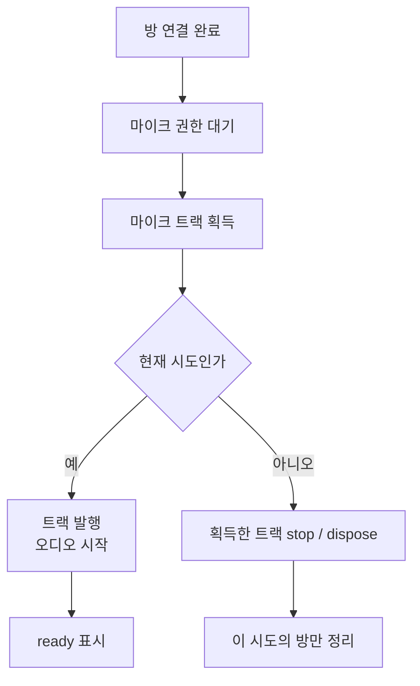

마이크 권한 창이 떠 있는 동안 사용자가 통화 화면을 나갔다고 하자. 잠시 뒤 권한을 허용하면, 이미 취소한 연결 작업이 마이크 트랙을 돌려줄 수 있다. 화면은 나갔는데 작업은 아직 끝나지 않은 상황이다.

결과를 화면에 쓰지 않는 것만으로는 부족하다. **뒤늦게 얻은 마이크를 정리할 주체도 필요하다.** VoiceLink의 Flutter 통화 코드는 연결마다 시도 번호를 붙이고, 그 시도가 만든 방과 트랙을 따로 잡아둔다.

## 방 연결 다음에도 기다릴 일이 있다



코드는 `Room` 연결 뒤 마이크 트랙을 얻는다. 사용자가 권한 창에서 결정하지 않았다면 방 연결은 끝났어도 통화 준비는 대기 중이다.

코드의 제한 시간은 방 연결을 기다리는 구간에 걸려 있다. 이후 권한 대기와 오디오 재생이 남으므로, 방 연결 성공을 곧바로 통화 준비 완료로 표시하면 상태가 앞서 나간다.

## 옛 시도가 새 방을 닫으면 안 된다

설명용으로 다음 순서를 놓아보자.

1. 첫 통화가 권한 응답을 기다린다.
2. 사용자가 나갔다가 새 통화를 시작한다.
3. 첫 통화의 권한 응답이나 오류가 뒤늦게 돌아온다.

여기서 공용 `disconnect()`를 호출하면 지금 서비스가 들고 있는 새 방까지 닫을 수 있다. 옛 통화를 청소하다 새 손님을 내보내는 셈이다. 그래서 정리 코드도 “실패했나”뿐 아니라 **“어느 시도가 실패했나”**를 확인한다.

```dart
if (isCurrent()) {
  await disconnect();
} else if (attemptRoom != null) {
  // Clean up this attempt only; never disconnect a newer room.
  await _disposeRoom(attemptRoom);
  throw CallConnectionCancelled();
}
```

현재 시도면 서비스의 연결을 정리하고, 옛 시도면 그 시도가 만든 `attemptRoom`만 닫는다. 단순한 연결 여부 대신 시도 번호를 비교해야 재진입 후의 새 연결을 구별할 수 있다.

권한 응답으로 트랙을 얻은 뒤에도 시도 번호를 확인한다. 이미 취소된 시도라면 트랙을 발행하지 않고 `stop`·`dispose`하는 경로로 간다. 오래된 결과를 화면에 쓰지 않는 것과 자원을 닫는 것은 둘 다 필요하다.

## 무엇을 확인해야 취소가 끝났다고 할까

취소를 확인하려면 화면이 닫혔는지뿐 아니라, 옛 자원은 닫히고 새 연결은 남았는지를 함께 봐야 한다.

권한 대기 중 나가기, 곧바로 새 통화 시작하기, 이전 권한 허용을 순서대로 재현한다면 새 통화가 유지되는지와 이전 트랙이 정리되는지를 함께 봐야 한다. 화면의 오류 메시지만 확인해서는 부족하다.

취소 버튼은 기다리던 작업의 시간을 되돌리지 못한다. 늦게 도착한 결과까지 자기 시도의 자원으로 정리해야, 다음 통화를 건드리지 않고 나갈 수 있다.

## 참고 자료

- [LiveKit 연결과 재연결](https://docs.livekit.io/intro/basics/connect/)
- [LiveKit 토큰과 권한](https://docs.livekit.io/frontends/reference/tokens-grants/)
- [ICE 표준](https://www.rfc-editor.org/rfc/rfc8445.html)
- [TURN 표준](https://www.rfc-editor.org/rfc/rfc8656.html)

근거: 2026-10-08 확인한 VoiceLink `1704b46`의 통화 서비스·연결 정책·관련 테스트와 생명주기 문서. 시나리오는 코드 흐름 설명용이며, 이번 글 개정에서 실기기 마이크 해제나 양방향 음성을 시험한 것은 아니다.
