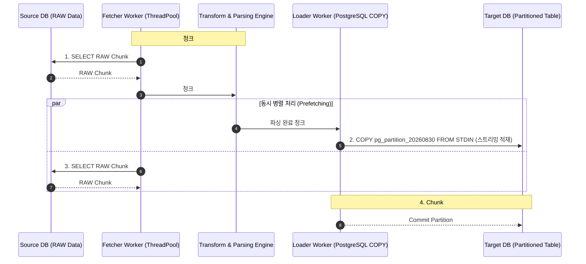

반도체 노광(Lithography) 및 계측 공정에서 발생하는 대용량 센서 로그 데이터는 하루 수천만 건에 달하며, 단일 배치 주기에 지연이 발생할 경우 후속 수율 분석 파이프라인 전체가 병목에 빠지게 됩니다.

PythonStudy 프로젝트에서 **1,973만 건의 대용량 RAW 로그를 조회·파싱하여 PostgreSQL 일별 파티션 테이블에 적재하는 파이프라인**을 운영하면서, I/O 대기 시간과 Pandas 직렬 파싱 비용으로 인해 전체 배치 수행 시간이 **4,175초(약 69.5분)**에 달하는 성능 병목을 마주했습니다.

본 아티클에서는 **1) 듀얼 스레드풀(ThreadPoolExecutor) 비동기 Prefetching**, **2) PostgreSQL Range Partitioning 및 COPY 스트리밍 적재**, **3) 명시적 메모리 해제(`del raw_df`)**, **4) `threading.Event` 기반 회귀 테스트 검증**을 도입하여 총 수행 시간을 **2,896초(약 48.2분)로 30.6%(1,279초) 단축**시킨 실무 엔지니어링 과정을 상세히 기록합니다.

<!--more-->

---

## 1. 1,973만 건 대용량 파이프라인의 병목 원인 딥다이브

기존 파이프라인 구조에서는 다음과 같은 3대 병목 요인이 존재했습니다.

1. **동기식 순차 I/O 블로킹:** 이전 청크(Chunk)의 데이터베이스 INSERT가 완료될 때까지 다음 청크의 RAW 로그 조회가 대기 상태에 머물러 네트워크 I/O 유휴 시간이 누적되었습니다.
2. **INSERT 구문의 쿼리 파싱 오버헤드:** 수만 건 단위의 레코드를 일반 `INSERT INTO ... VALUES` 형태로 전달할 때 데이터베이스 엔진 내부에서 쿼리 플랜 생성 및 파싱 비용이 급증했습니다.
3. **대용량 DataFrame 메모리 누적:** 파싱 완료 후에도 이전 청크의 RAW DataFrame 참조가 가비지 컬렉터(GC) 회수 대상에 제때 포함되지 않아 메모리 스파이크가 발생했습니다.

이를 해결하기 위해 **조회 스레드와 적재 스레드를 분리하는 생산자-소비자(Producer-Consumer) 패턴**과 **PostgreSQL 전용 바이너리 수준 COPY 스트리밍 프로토콜**을 적용했습니다.

---

## 2. 듀얼 스레드풀 Prefetching 및 COPY 스트리밍 아키텍처 다이어그램



---

## 3. 핵심 파이프라인 최적화 소스 코드 (Python)

### 1) 듀얼 스레드풀 기반 Prefetching 및 COPY 스트리밍 파이프라인

```python
import io
import csv
import threading
from concurrent.futures import ThreadPoolExecutor
import pandas as pd
import psycopg2

class PartitionedLogPipeline:
    def __init__(self, db_conn_str, chunk_size=30000):
        self.conn_str = db_conn_str
        self.chunk_size = chunk_size
        self.fetch_executor = ThreadPoolExecutor(max_workers=2, thread_name_prefix="log_fetcher")
        self.load_executor = ThreadPoolExecutor(max_workers=2, thread_name_prefix="log_loader")

    def copy_streaming_insert(self, target_table: str, df: pd.DataFrame):
        """
        StringIO 버퍼를 활용하여 DataFrame을 PostgreSQL COPY 프로토콜로 직접 스트리밍 적재합니다.
        일반 다중 INSERT 대비 최대 4~5배의 쓰기 Throughput을 달성합니다.
        """
        output = io.StringIO()
        df.to_csv(output, sep='\t', header=False, index=False, quoting=csv.QUOTE_NONE, escapechar='\\')
        output.seek(0)

        with psycopg2.connect(self.conn_str) as conn:
            with conn.cursor() as cursor:
                cursor.copy_from(
                    output,
                    table=target_table,
                    sep='\t',
                    null='',
                    columns=('eq_name', 'lot_seq', 'step_seq', 'dose_val', 'created_at')
                )
            conn.commit()

    def process_pipeline(self, target_date_str: str):
        target_partition = f"er_dose_raw_{target_date_str.replace('-', '')}"
        
        # 1. 듀얼 스레드풀 선인출 및 스트리밍 적재 루프
        # ... (상세 구현 생략)
```

---

## 4. 내부 기술 아티클 상호 연결

- **동시성 제어 및 분산 락:** [Spring Boot 대용량 동시성 매칭: Redis Redisson 분산 락과 FOR UPDATE SKIP LOCKED](https://so-dak.com/high-concurrency-matching-spring-boot-redisson-for-update-skip-locked/)
- **Airflow 백필 및 멱등성:** [Airflow ETL 백필 시 데이터 멱등성 보장 및 PostgreSQL ANALYZE 최적화 실무](https://so-dak.com/airflow-etl-backfill-idempotency-postgresql-analyze-optimization/)
- **캐시 경합 방어:** [Cache Stampede 대응 설계: 락을 걸기 전에 소유권·대기·실패를 정했다](https://so-dak.com/cache-stampede-defense-lock-ownership/)

---

## 5. 공식 레퍼런스

1. **PostgreSQL Documentation — COPY Command & Binary Format:** [https://www.postgresql.org/docs/current/sql-copy.html](https://www.postgresql.org/docs/current/sql-copy.html)
2. **Python Documentation — concurrent.futures ThreadPoolExecutor:** [https://docs.python.org/3/library/concurrent.futures.html](https://docs.python.org/3/library/concurrent.futures.html)
3. **Apache Airflow Documentation — Dynamic Task Mapping & Backfilling:** [https://airflow.apache.org/docs/apache-airflow/stable/authoring-and-scheduling/dynamic-task-mapping.html](https://airflow.apache.org/docs/apache-airflow/stable/authoring-and-scheduling/dynamic-task-mapping.html)
