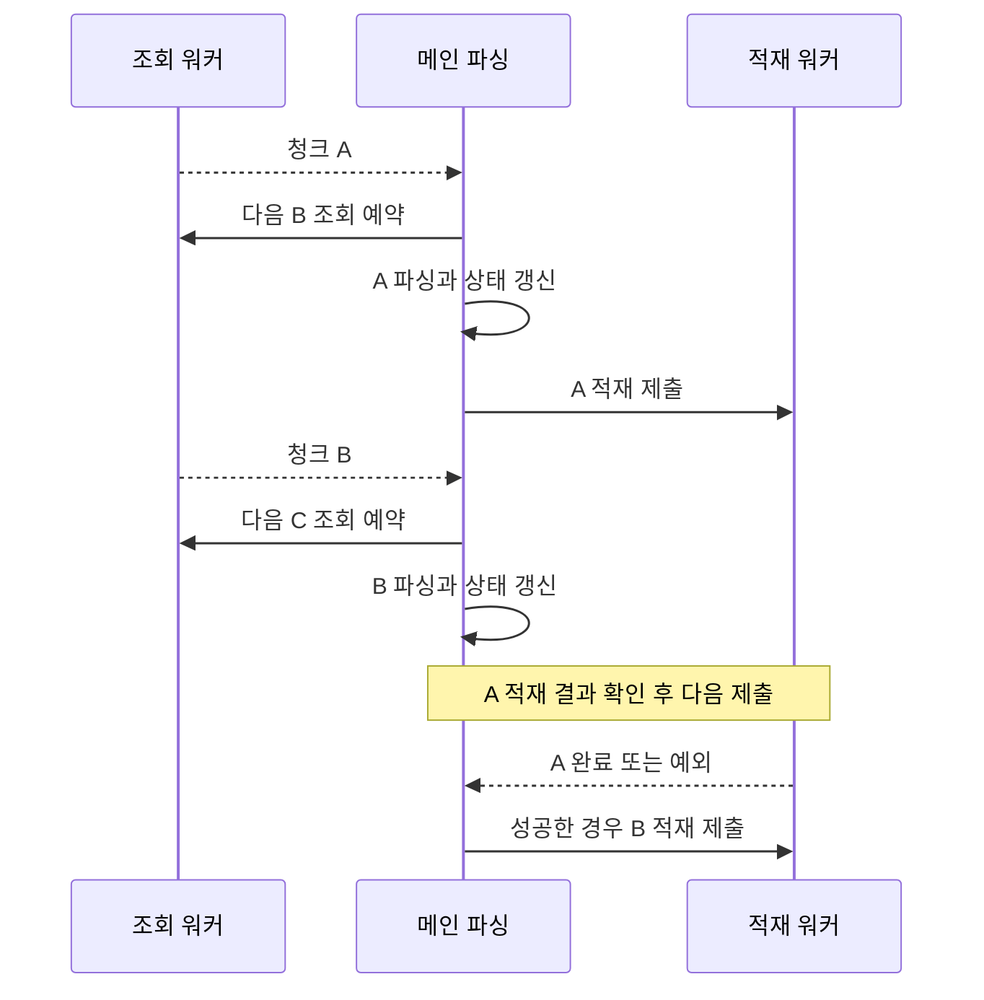

PythonStudy의 개선 문서에는 조회·파싱·적재를 차례로 기다리면서 대기 시간이 쌓였다는 배경이 남아 있다. 그렇다면 청크마다 스레드를 붙이면 될까?

RAW 파서는 앞 로그에서 읽은 설비별 lot 정보를 다음 로그에 채워 넣는다. 순서를 바꾸면 빠르게 틀린 데이터를 만들 수 있다. `9a324fe`의 코드는 **파싱 순서는 남기고 조회와 적재의 대기를 겹치는 쪽**이다.

## A를 파싱할 때 B를 미리 읽는다



조회 워커는 다음 청크를 읽고, 메인 흐름은 현재 청크를 파싱한다. 적재 워커가 A를 저장하는 동안 메인은 B를 파싱할 수 있다. **파싱 자체는 A 다음 B 순서로 진행한다.**

예를 들어 A의 마지막 행에 새 lot 이름이 있고 B의 첫 행에는 없다고 하자. 파서는 `lot_states`에 기억한 이름으로 B를 채운다. B를 먼저 파싱하면 아직 갱신되지 않은 이름을 쓰게 된다. 파싱을 병렬화하려면 작업을 나누는 기준과 시작 상태를 따로 설계해야 하는 이유다.

다음 읽기는 하나씩 예약하고 새 적재를 제출하기 전에는 이전 적재 결과를 받는다. 조회가 빠르다고 계속 앞서가면 적재를 기다리는 데이터만 메모리에 쌓인다. **느린 적재에 맞춰 다음 제출을 기다리는 것**도 이 구조의 일부다.

## 청크 크기만으로 메모리를 설명할 수는 없다

공통 DB 클래스가 직접 연결을 만드는 경로는 다음과 같다.

```python
with engine.connect().execution_options(
    stream_results=True,
    max_row_buffer=chunk_size,
) as connection:
    result = connection.execute(statement, parameters)
    columns = list(result.keys())
    while True:
        rows = result.fetchmany(chunk_size)
        if not rows:
            break
        yield pd.DataFrame(rows, columns=columns)
```

서버 측 커서 사용을 요청하고 `fetchmany`로 나눠 읽는다. 반복문이 청크를 반환한다는 사실만으로 드라이버의 전체 수신 방식까지 알 수는 없어 연결 옵션을 함께 본 것이다.

이 제너레이터는 같은 연결과 결과를 유지한다. 청크마다 DB를 다시 연결하는 구조가 아니다. 외부 연결을 받는 분기는 별도 경로이므로 같은 옵션을 자동으로 적용한다고 볼 수도 없다.

메모리에는 선행 조회한 원본, 현재 파싱 결과, 적재용 버퍼가 함께 있을 수 있다. 청크 행 수 하나보다 어느 객체가 동시에 남는지 살펴야 한다.

## A의 적재가 실패했는데 B를 계속 넣으면

워커에서 예외가 나도 메인이 그 결과를 받지 않으면 성공 경로를 계속 진행할 수 있다. 실제 처리기는 다음 적재를 제출하기 전에 앞 작업의 `result()`를 읽는다.

```python
if pending_insert is not None:
    inserted_chunk_index, insert_future = pending_insert
    chunk_inserted = insert_future.result()
    insert_count += chunk_inserted
    # 처리 건수 로그는 생략
    pending_insert = None
```

**여기서 적재 실패가 메인으로 전달된다.** 마지막으로 남은 적재도 확인한 뒤 처리를 끝낸다. 작업을 제출한 수와 저장 완료한 수를 혼동하지 않도록 하는 지점이다.

관련 테스트는 적재를 잠시 멈춘 사이 다음 조회가 시작되는지, 파싱 중 다음 청크를 미리 읽는지, 적재 예외가 메인으로 올라오는지를 각각 검사한다. 워커 개수보다 실제로 겹쳐도 되는 일이 겹쳤는지를 보는 구성이다.

## 날짜 재처리는 별도의 문제다

현재 날짜 재적재는 대상 파티션을 비운 뒤 청크별로 채운다. A가 커밋되고 B에서 실패했다면 날짜 전체가 원래대로 돌아가는 것은 아니다. 조회·적재를 겹쳤다고 이 중간 상태가 없어지지는 않는다.

따라서 [재실행할 때](https://so-dak.com/airflow-%eb%b0%b1%ed%95%84backfill-%eb%a9%b1%eb%93%b1%ec%84%b1-%ed%9a%8c%ea%b3%a0-%ec%97%90%eb%9f%ac-%eb%82%98%eb%a9%b4-clear-%eb%88%84%eb%a5%b4%ea%b3%a0-%ec%9e%ac%ec%8b%a4%ed%96%89%ed%95%98/)는 이미 저장된 청크와 일별 집계가 어느 상태인지 확인해야 한다. 파싱이 대부분의 시간을 차지한다면 워커를 더 붙여도 기다릴 구간이 별로 없다. 다음 비교에서는 전체 시간 하나보다 조회·파싱·적재 중 어디서 기다리는지부터 보고 싶다.

## 참고 자료

- [SQLAlchemy 서버 측 커서와 스트리밍](https://docs.sqlalchemy.org/en/20/core/connections.html#using-server-side-cursors-a-k-a-stream-results)
- [Python Future와 ThreadPoolExecutor](https://docs.python.org/3/library/concurrent.futures.html)
- [PostgreSQL 9.4 COPY](https://www.postgresql.org/docs/9.4/sql-copy.html)

검토한 소스: PythonStudy `9a324fe`의 RAW 처리기와 날짜 재적재 경로, 공통 DB 계층, 처리기 테스트와 기존 파이프라인 개선 문서. PostgreSQL 9.4 제약이 있는 작업이므로 최신 SQL 문법을 그대로 가져온 운영 예제는 제시하지 않았다. 2026-10-08에 코드와 테스트 구성을 재확인했다. 이번 개정에서 테스트나 실DB 성능 측정을 새로 실행하지 않았다.
