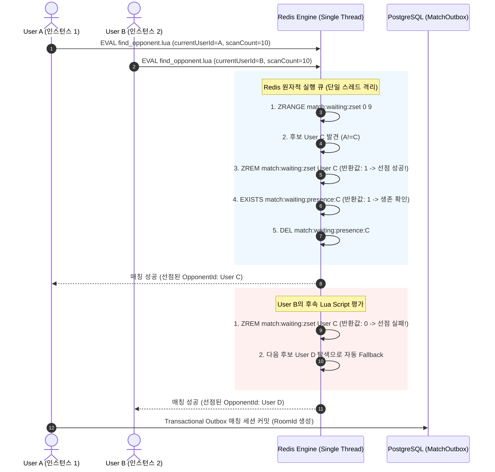

실시간 1:1 음성 통화 플랫폼(VoiceLink)에서 수백 명의 동시 접속자가 매칭 큐에 진입할 때 가장 치명적인 장애는 **동일한 사용자가 서로 다른 2개의 통화 세션에 동시에 배정되는 이중 매칭(Double Booking) 경합 상태(Race Condition)**입니다.

다중 분산 애플리케이션 인스턴스 환경에서 일반적인 `ZRANGE` 후 `ZREM` 방식의 2-Step 조회는 동시성 트래픽이 몰릴 때 두 인스턴스가 동일한 대기자를 읽어 각자 다른 상대와 매칭을 체결해 버리는 치명적인 데이터 정합성 결함을 유발합니다. VoiceLink에서는 **Redis Single-Threaded Lua Script**의 원자적 연산과 **TTL Presence Key를 결합한 Stale 세션 능동 격리 아키텍처**를 구축하여 동시성 경합 상황에서도 이중 매칭을 0건으로 완전 방어했습니다.

<!--more-->

---

## 1. 분산 매칭 큐의 동시성 경합과 Stale 세션 한계 원리

기존의 일반적인 Sorted Set(ZSET) 기반 FIFO 대기열 구조에서는 다음과 같은 3대 핵심 문제가 발생합니다.

- **TOCTOU(Time-of-Check to Time-of-Use) 레이스 컨디션:** Instance A와 Instance B가 거의 동시에 `ZRANGEBYSCORE`로 대기열 최상위 사용자 `User-101`을 조회합니다. 두 인스턴스 모두 아직 삭제되지 않은 `User-101`을 확인한 뒤 각자 다른 상대방(`User-201`, `User-301`)과 매칭을 성사시키고 방을 생성하여, `User-101`에게 두 개의 통화 웹훅이 동시에 전송됩니다.
- **비정상 종료로 인한 고스트(Ghost/Stale) 대기자 누적:** 모바일 네트워크 단절이나 강제 앱 종료 시 ZSET에 등록된 사용자 ID가 명시적으로 제거되지 않고 남아있어, 유효한 사용자가 연결이 끊어진 유령 사용자와 매칭되어 무한 대기에 빠집니다.
- **분산 락(Distributed Lock)의 오버헤드와 블로킹:** Redlock이나 SpEL 기반 메서드 락을 전체 매칭 큐에 걸 경우, 매칭 탐색 throughput이 급격히 저하되어 초당 매칭 처리량이 병목에 도달합니다.

VoiceLink는 락 획득 대기 없이 **Redis 엔진 내부에서 단일 연산으로 실행되는 원자적 Lua Script**를 통해 매칭 탐색, 자기 자신 제외, 선점 검증(`ZREM == 1`), Presence TTL 생존 검증(`EXISTS`), Presence 즉시 소멸(`DEL`)을 마이크로초 단위로 단일 왕복(1 RTT)에 완결합니다.

> 💡 **실무 운영 팁:** Redis Lua Script는 실행되는 동안 다른 모든 Redis 명령을 블로킹하므로, 스크립트 내부에서 `KEYS *`나 무한 루프를 절대 호출하지 않고 `ZRANGE 0 (N-1)`로 탐색 윈도우를 최대 10개로 제한(Bounded Scan)해야 Redis 단일 스레드 이벤트 루프의 지연(Latency Spike)을 방지할 수 있습니다.

---

## 2. Redis Lua Script 원자적 선점 및 생애주기 다이어그램

아래 다이어그램은 분산 서버 인스턴스 2대가 동일한 대기열 후보를 탐색할 때 Lua Script가 원자적 선점을 보장하고 Stale 세션을 정화하는 과정을 보여줍니다.



---

## 3. VoiceLink 실무 핵심 소스 코드 (Spring Boot & Lua)

VoiceLink 실무에 적용된 Redis 원자적 선점 스크립트와 Java Spring Boot 컴포넌트 구현체입니다.

### 1) Redis 원자적 상대 선점 스크립트 (find_opponent.lua)
```lua
-- KEYS[1]: 대기열 ZSET 키 ("match:waiting:zset")
-- KEYS[2]: presence 키 접두사 ("match:waiting:presence:")
-- ARGV[1]: 현재 매칭을 요청하는 사용자의 ID
-- ARGV[2]: 한 번에 스캔할 배치 크기 (예: 10)

local waitingZsetKey = KEYS[1]
local presencePrefix = KEYS[2]
local currentUserId = ARGV[1]
local scanCount = tonumber(ARGV[2]) - 1

-- 1. 대기열 최상위 후보들을 제거하지 않고 배치로 조회
local candidates = redis.call('ZRANGE', waitingZsetKey, 0, scanCount)

if not candidates or #candidates == 0 then
    return nil
end

for i, candidateId in ipairs(candidates) do
    -- 2. 자기 자신과는 매칭하지 않음
    if candidateId ~= currentUserId then
        -- 3. ZSET에서 후보를 원자적으로 제거하여 선점 시도
        local removed = redis.call('ZREM', waitingZsetKey, candidateId)

        -- 4. 선점에 성공한 경우 (removed == 1)
        if removed == 1 then
            local presenceKey = presencePrefix .. candidateId
            -- 5. Heartbeat Presence 키 확인 (Stale 세션 여부 검증)
            if redis.call('EXISTS', presenceKey) == 1 then
                -- 6. 정상 생존 사용자 확인: Presence 키 즉시 삭제 후 최종 매칭 상대로 반환
                redis.call('DEL', presenceKey)
                return candidateId
            else
                -- 7. Stale 상태 사용자: ZSET에서는 이미 삭제되었으므로 자동 정리 완료
                -- 다음 후보로 루프 계속 진행
            end
        end
        -- removed == 0: 다른 인스턴스가 찰나의 순간에 먼저 선점함. 다음 후보 탐색
    end
end

return nil
```

### 2) Java Spring Boot RedisMatchingStore 컴포넌트
```java
package kr.co.voicelink.match.infrastructure;

import jakarta.annotation.PostConstruct;
import kr.co.voicelink.match.MatchProperties;
import org.slf4j.Logger;
import org.slf4j.LoggerFactory;
import org.springframework.core.io.ClassPathResource;
import org.springframework.data.redis.core.RedisTemplate;
import org.springframework.data.redis.core.script.DefaultRedisScript;
import org.springframework.scripting.support.ResourceScriptSource;
import org.springframework.stereotype.Component;

import java.util.List;

@Component
public class RedisMatchingStore {

    private static final Logger log = LoggerFactory.getLogger(RedisMatchingStore.class);

    private static final String WAITING_ZSET_KEY = "match:waiting:zset";
    private static final String WAITING_KEY_PREFIX = "match:waiting:presence:";

    private final RedisTemplate<String, String> redisTemplate;
    private final MatchProperties matchProperties;
    private DefaultRedisScript<String> findOpponentScript;

    public RedisMatchingStore(RedisTemplate<String, String> redisTemplate,
                              MatchProperties matchProperties) {
        this.redisTemplate = redisTemplate;
        this.matchProperties = matchProperties;
    }

    @PostConstruct
    public void init() {
        findOpponentScript = new DefaultRedisScript<>();
        findOpponentScript.setScriptSource(new ResourceScriptSource(new ClassPathResource("scripts/find_opponent.lua")));
        findOpponentScript.setResultType(String.class);
    }

    /**
     * Redis Lua Script를 호출하여 원자적으로 상대를 선점합니다.
     * 이중 매칭(Double Booking)과 Stale 대기열을 1 RTT 내에서 완벽히 방어합니다.
     */
    public Long pollOtherUserIdAtomically(Long currentUserId) {
        try {
            String candidateId = redisTemplate.execute(
                    findOpponentScript,
                    List.of(WAITING_ZSET_KEY, WAITING_KEY_PREFIX),
                    String.valueOf(currentUserId),
                    String.valueOf(matchProperties.luaScanCount())
            );

            if (candidateId != null && !candidateId.isBlank()) {
                return Long.parseLong(candidateId);
            }
        } catch (Exception e) {
            log.error("매칭 상대 탐색 Lua 스크립트 실행 실패: userId={}", currentUserId, e);
        }
        return null;
    }
}
```

---

## 4. 내부 기술 아티클 상호 연결 (Internal Knowledge Linkage)

본 아키텍처는 고가용성 백엔드 및 대용량 트랜잭션 파이프라인 설계 원칙과 직접적으로 맞닿아 있습니다. 자세한 연계 패턴은 아래 아티클들을 참조하시기 바랍니다.

- **동일 키 동시 조회 경합 및 스탬피드 제어:** [Cache Stampede 대응 설계: 락을 걸기 전에 소유권·대기·실패를 정했다](https://so-dak.com/cache-stampede-defense-lock-ownership/)
- **대용량 트랜잭션 적재 및 파이프라인 최적화:** [[PythonStudy] 대용량 RAW 로그 1,973만 건 파이프라인 최적화: 듀얼 스레드풀 Prefetching과 COPY 스트리밍으로 30.6% 단축하기](https://so-dak.com/pythonstudy-raw-log-pipeline-optimization/)
- **웹훅 지연 및 통화 미디어 세션 안정화:** [LiveKit 연동 회고: 토큰 발급보다 웹훅 지연과 재접속 처리가 어려웠다](https://so-dak.com/livekit-webhook-reconnection-retrospective/)

---

## 5. 공식 표준 문서 및 레퍼런스 (References)

1. **Redis Documentation — Scripting with Lua:** [https://redis.io/docs/latest/develop/interact/programmability/eval-intro/](https://redis.io/docs/latest/develop/interact/programmability/eval-intro/)
2. **Redis Command Reference — ZREM & ZRANGE:** [https://redis.io/docs/latest/commands/zrem/](https://redis.io/docs/latest/commands/zrem/)
3. **Spring Data Redis — RedisScript Reference Documentation:** [https://docs.spring.io/spring-data/redis/reference/redis/scripting.html](https://docs.spring.io/spring-data/redis/reference/redis/scripting.html)
4. **Martin Kleppmann — Designing Data-Intensive Applications (Atomic Operations & Linearizability)**
