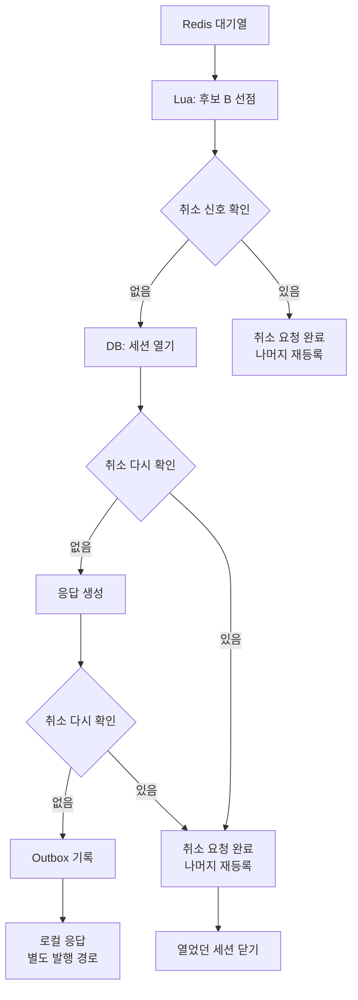

대기열의 B를 A와 C가 동시에 읽었다고 하자. “B를 찾았다”만으로 둘 다 반환하면 같은 사람에게 통화 상대가 두 명 생길 수 있다.

VoiceLink의 Java 17·Spring Boot 3.2.5 매칭 코드는 후보를 찾은 사실보다 **이번 요청이 대기열에서 후보를 제거했는지**를 본다. Lua가 먼저 해결하는 것은 이 선점 경쟁이다.

## 읽기와 제거 사이를 묶는다

후보를 읽고 나중에 별도 요청으로 지우면 그 사이에 다른 요청이 끼어들 수 있다. Lua 안에서 제거 결과와 유효한 대기 표시를 함께 확인한다. 후보 순회·입력 처리를 줄인 실제 발췌다.

```lua
local removed = redis.call('ZREM', waitingZsetKey, candidateId)
if removed == 1 then
    local presenceKey = presencePrefix .. candidateId
    if redis.call('EXISTS', presenceKey) == 1 then
        redis.call('DEL', presenceKey)
        return candidateId
    end
end
```

`ZREM`이 1일 때만 이번 요청이 후보를 제거한 것이다. 이어 presence 키가 남아 있는 후보를 반환한다. Lua 실행 도중 다른 명령이 끼어들지 않으므로 이 판단을 한 덩어리로 할 수 있다.

## 같은 후보에 두 요청을 보내봤다

2026년 10월 9일, Redis 8.2.0을 별도 로컬 인스턴스로 띄우고 VoiceLink `b159c1d`의 `find_opponent.lua`를 수정 없이 실행했다. 서비스 DB나 실제 사용자 없이 합성 대기열만 썼다.

매번 후보 B(ID 2) 한 명과 60초 presence를 넣었다. 별도 연결 두 개가 각각 A(ID 1), C(ID 3)로 요청하도록 스레드 배리어에서 출발을 맞췄고, 각 요청의 탐색 수는 10이었다. 대기열을 초기화하며 100회 반복했다.

```text
실험 회차: 100
B를 정확히 한 요청만 반환한 회차: 100
두 요청이 함께 B를 반환한 회차: 0
```

각 회차에서 두 반환값은 `2`와 `nil`이었다. 그 뒤 대기열 크기와 B의 presence가 모두 0인지도 확인했다. 이는 이 입력에서 Lua의 후보 선점 결과를 관찰한 값이다. 통화 성공률이나 운영 부하 테스트 수치로 해석하지 않는다.

## nil을 받아도 사람이 남아 있었다

이번에는 presence가 없는 ID 10·11을 앞에, 살아 있는 ID 12를 뒤에 넣었다. 스캔 수를 2로 제한하니 결과가 달라졌다.

| 실제 호출 | 반환값 | 남은 상태 |
| --- | --- | --- |
| 첫 탐색, scan=2 | `nil` | 오래된 후보 둘은 제거, 살아 있는 12는 대기 |
| 같은 조건의 두 번째 탐색 | `12` | 살아 있는 후보 선점 |

첫 요청은 자신이 본 두 후보를 정리했을 뿐, 세 번째 사람까지 본 것이 아니다. **빈 반환값은 이번 배치에서 유효한 상대를 못 찾았다는 뜻이다.** 대기열 전체가 비었다는 뜻으로 바꾸면 이 경우를 설명할 수 없다.

스크립트가 오래 돌면 다른 Redis 요청도 기다리므로 탐색 수를 제한할 이유는 있다. 다만 제한으로 빈 결과가 나왔을 때 다시 탐색할 흐름도 함께 봐야 한다. presence의 TTL도 실제 접속 종료를 즉시 알려 주는 센서는 아니다.

## 후보를 꺼낸 다음부터는 다른 문제

B를 선점한 직후 A가 취소했다고 해보자. B는 이미 대기열에서 빠졌다. 통화방 저장만 롤백하면 B는 줄에서도 빠지고 방에도 못 들어간다. 이름표는 받아 왔는데 갈 곳이 없는 셈이다.

**DB 롤백은 Redis 대기열을 되돌리지 않는다.** 그래서 매칭 확정 코드에는 취소한 사람과 계속 기다리는 사람을 구분하는 처리가 필요하다.


```mermaid
flowchart TD
 Q["Redis 대기열"] --> L["Lua: 후보 B 선점"]
 L --> C{"취소 신호 확인"}
 C -->|없음| S["DB: 세션 열기"]
 S --> C2{"취소 다시 확인"}
 C2 -->|없음| F["응답 생성"]
 F --> C3{"취소 다시 확인"}
 C3 -->|없음| O["Outbox 기록"]
 C -->|있음| R0["취소 요청 완료<br/>나머지 재등록"]
 C2 -->|있음| R["취소 요청 완료<br/>나머지 재등록"]
 C3 -->|있음| R
 R --> X["열었던 세션 닫기"]
 O --> D["로컬 응답<br/>별도 발행 경로"]
```

`MatchFinalizer`는 세션 생성 전후와 응답 생성 뒤에 취소 신호를 확인한다. 세션을 연 다음 취소를 확인한 부분은 다음과 같다.

```java
if (requeueOnCancelSignal(clientA, clientB)) {
    callSessionCommandPort.closeSessionSilently(sessionId, LocalDateTime.now());
    return;
}
```

`requeueOnCancelSignal` 안에서 취소한 요청을 완료하고 나머지를 재등록한 뒤, 열린 세션을 닫는다. 그림은 이 호출 순서이며 Redis 재등록과 DB 종료가 한 번에 커밋된다는 뜻은 아니다.

여기서 복구는 둘 다 대기열로 넣는 일이 아니다. A는 그만 기다리겠다고 했으니 종료하고 B만 다시 등록해야 한다. 두 사람을 함께 되돌리면 복구 코드가 취소 의사를 취소해 버린다.

`MatchFinalizerTest`는 저장 전 취소, 저장 후 취소, 응답 생성 뒤 취소를 나눠 다룬다. 저장 후 취소 테스트에서는 A에게 `WAITING`을 반환하고, B를 대기열에 등록하며, 세션을 닫고 Outbox 적재는 호출하지 않는지 검사한다.

2026년 10월 10일 같은 관련 소스의 로컬 `1704b46`에서 이 클래스의 테스트 8개와 `RedisMatchingStoreTest` 7개가 다시 통과했다. 대역을 쓰는 Java 시험으로, 앞의 10월 9일 실제 Redis 실험과 구분한다. 여기서 확인한 것은 **취소 시점에 따라 어떤 요청을 완료하고 누구를 재등록하는가**다.

## 반환값보다 남은 사람의 상태

선점 직후 DB 쓰기가 실패했다면 후보 ID보다 남은 상태가 중요하다. 세션은 없는지, B는 다시 기다리는지, 취소한 A가 대기열에 돌아오지는 않았는지를 함께 봐야 한다.

Java 분기 테스트의 재등록 호출이 성공했다고 실제 Redis 복구까지 끝난 것은 아니다. 다음에는 실제 Redis·DB를 함께 쓰고 세션 저장 직후에 취소를 넣어, B의 재등록과 닫힌 세션을 같이 확인할 차례다. 재등록 중 Redis 장애나 프로세스 종료는 아직 검증하지 않았다.

배포 구성이 Redis Cluster라면 한 가지 전제도 다시 봐야 한다. 이 스크립트는 접두사와 후보 ID로 presence 키를 만들기 때문에 키 전달·슬롯 배치 제약을 따로 검토해야 한다.

Lua의 성공은 이번 선점의 끝이다. 매칭의 끝은 그 사람이 **세션에 들어갔는지, 다시 기다리는지, 취소로 나갔는지**까지 정해졌을 때다.

## 참고 자료

- [Redis Lua 실행 모델](https://redis.io/docs/latest/develop/programmability/eval-intro/)
- [Redis ZRANGE](https://redis.io/docs/latest/commands/zrange/)
- [Redis ZREM](https://redis.io/docs/latest/commands/zrem/)
- [Spring Data Redis 스크립팅](https://docs.spring.io/spring-data/redis/reference/redis/scripting.html)

근거: VoiceLink `b159c1d`의 `find_opponent.lua`, `RedisMatchingStore`, `MatchFinalizer`, `application.yml`, 관련 테스트와 `docs/redis-matching-flow.md`·`docs/matching-call-lifecycle.md`. 2026-10-09 Redis 8.2.0 독립 실험에서 두 요청의 선점 100회와 제한 탐색을 실행했다. 관련 Java 단위 테스트 15개는 2026-10-10 재실행에서도 통과했다. Redis·DB·클라이언트를 묶은 전체 장애 실험은 아니다.
