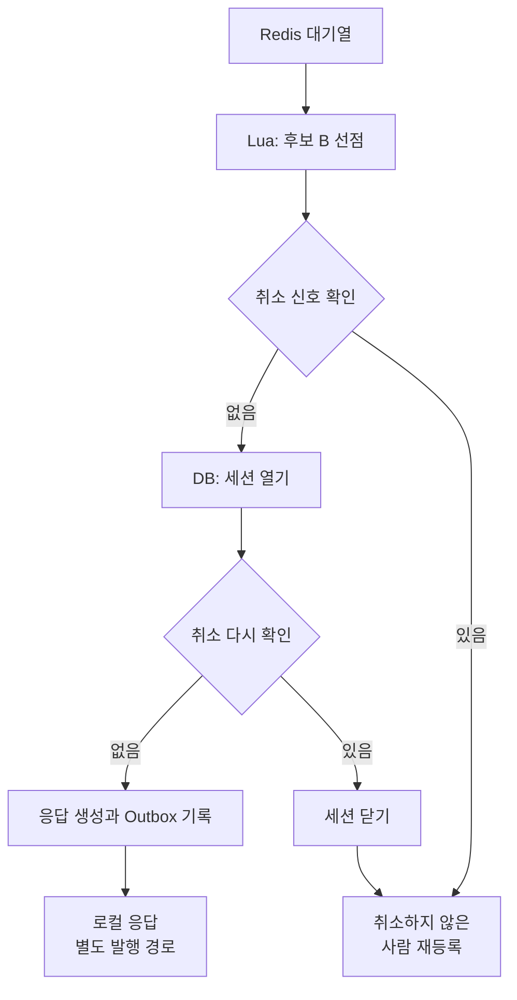

대기열의 B를 A와 C가 동시에 읽었다고 하자. “B를 찾았다”만으로 둘 다 반환하면 같은 사람에게 통화 상대가 두 명 생길 수 있다.

VoiceLink의 Java 17·Spring Boot 3.2.5 매칭 코드는 후보를 찾은 사실보다 **이번 요청이 대기열에서 후보를 제거했는지**를 본다. Lua가 먼저 해결하는 것은 이 선점 경쟁이다.

## 읽기와 제거 사이를 묶는다

후보를 읽고 나중에 별도 요청으로 지우면 그 사이에 다른 요청이 끼어들 수 있다. Lua 안에서 제거 결과와 유효한 대기 표시를 함께 확인한다. 후보 순회·입력 처리를 줄인 실제 발췌다.

```lua
local removed = redis.call('ZREM', waitingZsetKey, candidateId)
if removed == 1 then
    local presenceKey = presencePrefix .. candidateId
    if redis.call('EXISTS', presenceKey) == 1 then
        redis.call('DEL', presenceKey)
        return candidateId
    end
end
```

`ZREM`이 1일 때만 이번 요청이 후보를 제거한 것이다. 이어 presence 키가 남아 있는 후보를 반환한다. Lua 실행 도중 다른 명령이 끼어들지 않으므로 이 판단을 한 덩어리로 할 수 있다.

대신 스크립트가 오래 돌면 다른 Redis 요청도 기다린다. 후보 탐색을 제한하는 이유이며, 빈 결과가 전체 대기열에 사람이 없다는 뜻은 아니다. presence의 TTL 역시 실제 접속 종료를 즉시 알려 주는 센서는 아니다.

## 후보를 꺼낸 다음부터는 다른 문제

B를 선점한 직후 A가 취소했다고 해보자. B는 이미 대기열에서 빠졌다. 통화방 저장만 롤백하면 B는 줄에서도 빠지고 방에도 못 들어간다. 이름표는 받아 왔는데 갈 곳이 없는 셈이다.

**DB 롤백은 Redis 대기열을 되돌리지 않는다.** 그래서 매칭 확정 코드에는 취소한 사람과 계속 기다리는 사람을 구분하는 처리가 필요하다.


```mermaid
flowchart TD
 Q["Redis 대기열"] --> L["Lua: 후보 B 선점"]
 L --> C{"취소 신호 확인"}
 C -->|없음| S["DB: 세션 열기"]
 S --> C2{"취소 다시 확인"}
 C2 -->|없음| O["응답 생성과 Outbox 기록"]
 C -->|있음| R["취소하지 않은<br/>사람 재등록"]
 C2 -->|있음| X["세션 닫기"]
 X --> R
 O --> D["로컬 응답<br/>별도 발행 경로"]
```

`MatchFinalizer`는 세션 생성 전후와 응답 생성 뒤에 취소 신호를 확인한다. 세션을 연 다음 취소를 확인한 부분은 다음과 같다.

```java
if (requeueOnCancelSignal(clientA, clientB)) {
    callSessionCommandPort.closeSessionSilently(sessionId, LocalDateTime.now());
    return;
}
```

여기서 복구는 둘 다 대기열로 넣는 일이 아니다. A는 그만 기다리겠다고 했으니 종료하고 B만 다시 등록해야 한다. 두 사람을 함께 되돌리면 복구 코드가 취소 의사를 취소해 버린다.

관련 단위 테스트도 저장 전 취소, 저장 후 취소, 응답 생성 뒤 취소를 나눠 다룬다. 성공 경로보다 **취소가 어느 단계에 도착했는지**가 남길 상태를 바꾸기 때문이다.

## 반환값보다 남은 사람의 상태

선점 직후 DB 쓰기가 실패하는 상황이라면 후보 ID 반환만 검사해서는 부족하다. 세션이 남았는지, B가 다시 기다리는지, A의 취소가 유지되는지를 함께 봐야 한다.

재등록도 Redis 장애나 프로세스 종료로 실패할 수 있고 마지막 검사 직후 취소가 올 수도 있다. 다음 검증은 실제 Redis와 DB에서 이 순서를 멈췄다 진행하며 최종 상태를 보는 것이다. 대역을 쓰는 단위 테스트만으로 Lua 경쟁과 복구 완료를 확인했다고 볼 수는 없다.

배포 구성이 Redis Cluster라면 한 가지 전제도 다시 봐야 한다. 이 스크립트는 접두사와 후보 ID로 presence 키를 만들기 때문에 키 전달·슬롯 배치 제약을 따로 검토해야 한다.

Lua의 성공은 이번 선점의 끝이다. 매칭의 끝은 그 사람이 **세션에 들어갔는지, 다시 기다리는지, 취소로 나갔는지**까지 정해졌을 때다.

## 참고 자료

- [Redis Lua 실행 모델](https://redis.io/docs/latest/develop/programmability/eval-intro/)
- [Redis ZRANGE](https://redis.io/docs/latest/commands/zrange/)
- [Redis ZREM](https://redis.io/docs/latest/commands/zrem/)
- [Spring Data Redis 스크립팅](https://docs.spring.io/spring-data/redis/reference/redis/scripting.html)

검토 범위: VoiceLink `1704b46`의 `find_opponent.lua`, 매칭 저장소·확정 서비스·설정·관련 단위 테스트와 매칭 흐름 문서. A·B·C의 순서는 설명용이며 실제 Redis 경쟁·장애 주입 결과는 아니다.
