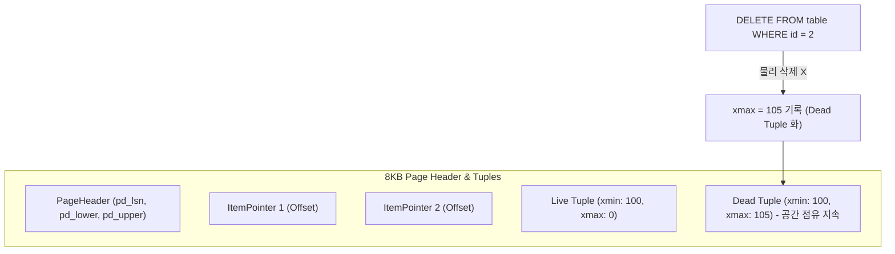
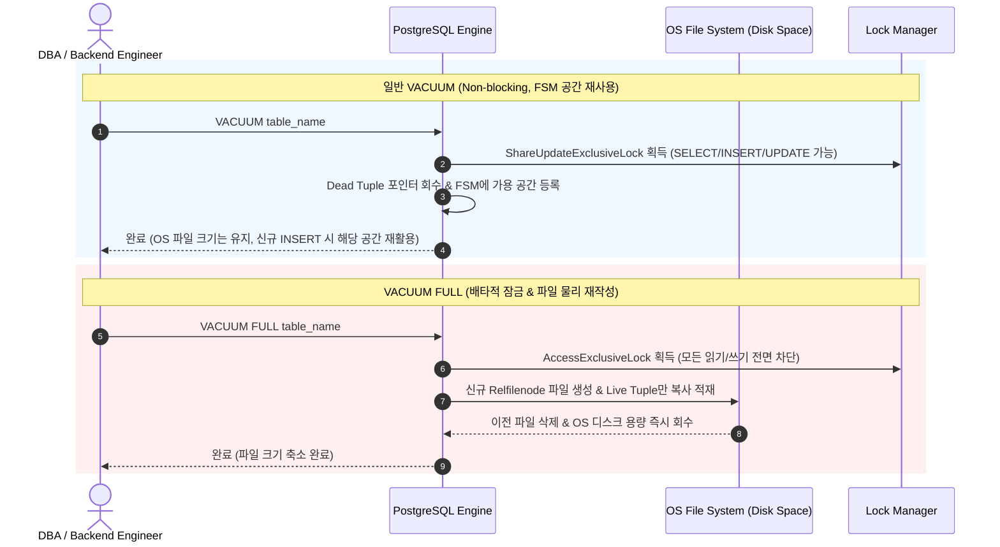

대량의 데이터를 DELETE하거나 UPDATE한 후에도 PostgreSQL 데이터 파일(`base/<db_oid>/<relfilenode>`) 크기가 줄어들지 않고 디스크 사용량이 그대로 유지되는 현상은 RDBMS 운영 현장에서 가장 빈번하게 마주치는 의문 중 하나입니다.

PostgreSQL은 동시성 트랜잭션의 격리 수준(Isolation Level)을 보장하기 위해 **MVCC(Multi-Version Concurrency Control)** 아키텍처를 채택하고 있으며, 데이터가 수정되거나 삭제될 때 기존 행을 직접 덮어쓰거나 물리적으로 즉시 삭제하지 않고 **Dead Tuple(사멸 튜플)**로 마킹한 뒤 보존합니다.

본 아티클에서는 **1) MVCC 튜플 가시성 메커니즘과 Dead Tuple 누적 원리**, **2) 일반 VACUUM과 VACUUM FULL의 디스크 공간 반환 차이**, **3) Free Space Map(FSM) 공간 재사용 원리**, **4) 장기 트랜잭션(Long-Running Transaction) 및 복제본 피드백으로 인한 VACUUM 블로킹 진단 쿼리**, **5) Autovacuum 임계치 튜닝 및 테이블 Bloat 관리 전략**을 상세히 다룹니다.

<!--more-->

---

## 1. DELETE 후에도 디스크 공간이 줄어들지 않는 근본 원인: MVCC와 Dead Tuple

PostgreSQL의 스토리지 엔진은 8KB 단위의 고정 크기 **Page(Block)** 구조로 데이터를 관리합니다.



1. **물리적 즉시 삭제 불가 (Append-Only MVCC):** `DELETE`가 실행되면 PostgreSQL은 해당 튜플을 물리적으로 디스크에서 제거하는 것이 아니라, 튜플 헤더의 `xmax` 필드에 해당 삭제 트랜잭션 ID를 기록합니다. 이 시점부터 해당 튜플은 `xmax` 이후에 시작된 트랜잭션에게는 보이지 않지만, 그 이전의 스냅샷을 읽고 있는 트랜잭션에게는 여전히 보수적으로 노출되어야 하므로 디스크 공간을 그대로 차지합니다.
2. **OS 디스크 반환의 한계:** 일반 `VACUUM`은 사멸 튜플을 정리하여 해당 8KB 페이지 내부의 **Free Space Map(FSM)**에 빈 공간으로 등록할 뿐, 페이지 자체를 OS 파일시스템에 잘라내어(`truncate`) 반환하지 않습니다. 따라서 OS 관점의 데이터베이스 파일 크기는 줄어들지 않고 그대로 유지됩니다.

---

## 2. 일반 VACUUM vs VACUUM FULL: 동작 원리 및 트레이드오프 비교



| 구분 | 일반 `VACUUM` | `VACUUM FULL` |
| :--- | :--- | :--- |
| **잠금 수준 (Lock)** | `ShareUpdateExclusiveLock` (DML 병렬 실행 허용) | `AccessExclusiveLock` (모든 읽기/쓰기 전면 차단) |
| **OS 디스크 공간 반환** | 원칙적으로 미반환 (페이지 끝단의 연속 빈 블록만 극히 드물게 Truncate) | **100% 반환 (파일을 신규로 완전히 재생성)** |
| **공간 재활용 방식** | 동일 테이블 내 신규 `INSERT`/`UPDATE` 시 FSM 공간 재사용 | 새로운 물리적 연속 페이지로 압축 재구성 |
| **추가 디스크 요구량** | 거의 없음 | **테이블 전체 크기만큼의 추가 임시 디스크 필요** |
| **운영 권장도** | **상시 자동 수행 (`autovacuum`) 권장** | 서비스 점검 시간이나 긴급 Bloat 해소 시 제한적 사용 |

---

## 3. 실무 필수: Dead Tuple 및 Bloat 진단 쿼리

### 1) 테이블별 Live Tuple 대비 Dead Tuple 비율 및 마지막 VACUUM 시각 조회

```sql
SELECT 
    schemaname,
    relname AS table_name,
    n_live_tup AS live_tuples,
    n_dead_tup AS dead_tuples,
    ROUND((n_dead_tup::numeric / NULLIF(n_live_tup + n_dead_tup, 0)) * 100, 2) AS dead_tuple_ratio,
    last_vacuum,
    last_autovacuum,
    last_analyze,
    last_autoanalyze
FROM pg_stat_user_tables
ORDER BY n_dead_tup DESC;
```

### 2) 테이블 본체 및 인덱스 용량 분리 측정

```sql
SELECT 
    relname AS table_name,
    pg_size_pretty(pg_relation_size(relid)) AS table_size,
    pg_size_pretty(pg_indexes_size(relid)) AS index_size,
    pg_size_pretty(pg_total_relation_size(relid)) AS total_size
FROM pg_stat_user_tables
ORDER BY pg_total_relation_size(relid) DESC;
```

---

## 4. VACUUM이 Dead Tuple을 지우지 못하게 막는 3대 복병

만약 `VACUUM`을 수동 실행했음에도 `dead_tuples`가 줄어들지 않는다면 다음 3가지 요인을 반드시 점검해야 합니다.

1. **오래 열려있는 장기 트랜잭션 (Long-Running Transaction):**
   - 오래 전에 시작되어 아직 `COMMIT`되지 않은 트랜잭션이 존재하면, 해당 트랜잭션의 스냅샷 기준점(xmin)보다 나중에 생성된 Dead Tuple은 VACUUM이 정리할 수 없습니다.
   ```sql
   SELECT pid, now() - xact_start AS duration, query, state 
   FROM pg_stat_activity 
   WHERE state != 'idle' 
   ORDER BY duration DESC;
   ```
2. **미사용 복제 슬롯 (Abandoned Replication Slot):**
   - 논리적/물리적 복제 슬롯이 연결이 끊어진 채 남아 있으면, PostgreSQL은 복제본을 위해 WAL 및 사멸 튜플 정보를 영구 보존합니다.
   ```sql
   SELECT slot_name, active, restart_lsn, xmin, catalog_xmin 
   FROM pg_replication_slots;
   ```
3. **읽기 복제본의 `hot_standby_feedback = on`:**
   - 대기 복제본(Read Replica)에서 장시간 분석 쿼리가 실행 중일 때, 주 서버(Primary)에 피드백을 전달하여 주 서버의 Dead Tuple 정리를 지연시킵니다.

---

## 5. 실무 Autovacuum 튜닝 가이드

대용량 트래픽 환경에서 기본값(20% 변경 시 발동)은 테이블 크기가 커질수록 Autovacuum 주기를 지나치게 지연시킵니다 (예: 1,000만 건 테이블은 200만 건이 변경되어야 발동).

따라서 빈번한 수정이 발생하는 핵심 테이블은 다음과 같이 개별 파라미터를 튜닝합니다:

```sql
-- 5만 건 이상 또는 5% 변경 시 즉시 autovacuum 작동하도록 세부 튜닝
ALTER TABLE payment_history SET (
    autovacuum_vacuum_scale_factor = 0.05,
    autovacuum_vacuum_threshold = 50000,
    autovacuum_vacuum_cost_limit = 2000
);
```

---

## 6. 결론 및 요약

- `DELETE` 후 파일 크기가 줄지 않는 것은 버그가 아니라 **MVCC 트랜잭션 격리와 FSM 공간 재사용 메커니즘**에 기인합니다.
- 긴급한 디스크 반환이 필요할 때는 `VACUUM FULL` 또는 `pg_repack`(락 없는 무중단 재구성 도구)을 고려할 수 있습니다.
- 근본적인 방어책은 **적절한 Autovacuum Scale Factor 튜닝**, **장기 트랜잭션 모니터링**, **불필요한 인덱스 정리(HOT 업데이트 유도)**입니다.

---

## 📚 참고 자료
- [PostgreSQL Official Documentation: Routine Vacuuming](https://www.postgresql.org/docs/current/routine-vacuuming.html)
- [PostgreSQL Official Documentation: Concurrency Control (MVCC)](https://www.postgresql.org/docs/current/mvcc-intro.html)
- [PostgreSQL Statistics Collector & Monitoring](https://www.postgresql.org/docs/current/monitoring-stats.html)
